# Mortgage CRM — User Flows by Role

Visual flows for Super Admin, Tenant Admin, Team Lead and Broker, plus the shared
login flow everyone passes through. Written to be readable by anyone.

> The diagrams below render automatically in GitHub, Notion, Obsidian, VS Code and
> most markdown tools. If you're reading this in plain text, every diagram has a
> written explanation beside it.

---

## How to read the diagrams

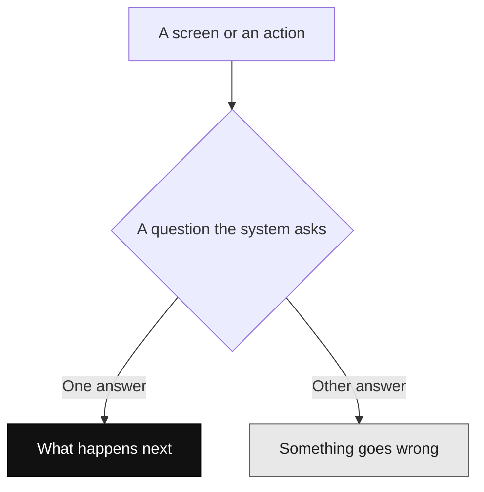
```mermaid
flowchart TD
    A["A screen or an action"] --> B{"A question the system asks"}
    B -->|One answer| C["What happens next"]
    B -->|Other answer| D["Something goes wrong"]
    class C good
    class D bad
    classDef good fill:#111111,stroke:#000000,color:#ffffff
    classDef bad fill:#e8e8e8,stroke:#5a5a5a,color:#1a1a1a
```

Rectangles are screens or things that happen. Diamonds are decisions.
A black box is the outcome you want. A grey dashed box is blocked or failed.

---

## Who uses the platform

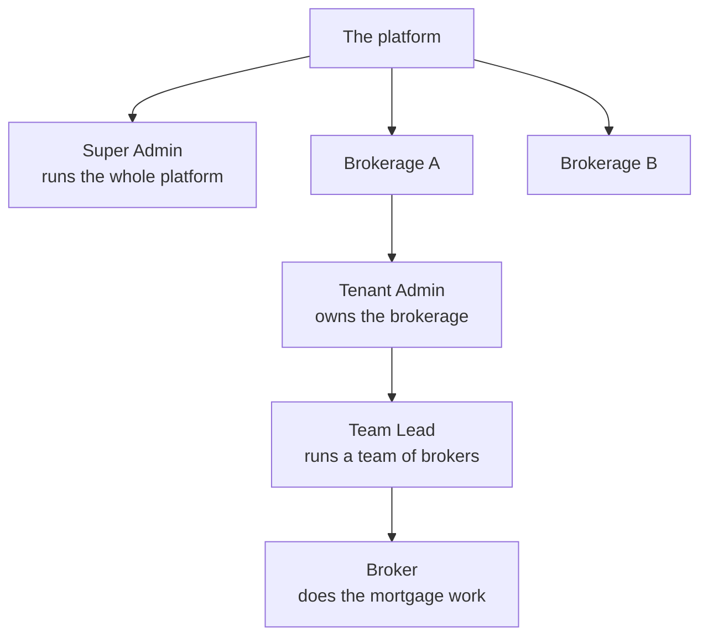
```mermaid
flowchart TD
    P["The platform"] --> SA["Super Admin<br/>runs the whole platform"]
    P --> B1["Brokerage A"]
    P --> B2["Brokerage B"]
    B1 --> TA["Tenant Admin<br/>owns the brokerage"]
    TA --> TL["Team Lead<br/>runs a team of brokers"]
    TL --> BR["Broker<br/>does the mortgage work"]
```

Each brokerage is a sealed box. One brokerage can never see another one's data,
and the Super Admin cannot open anyone's client records.

---

# FLOW 0 — Getting in

There is no public sign-up. You have an account because someone invited you.

## Logging in

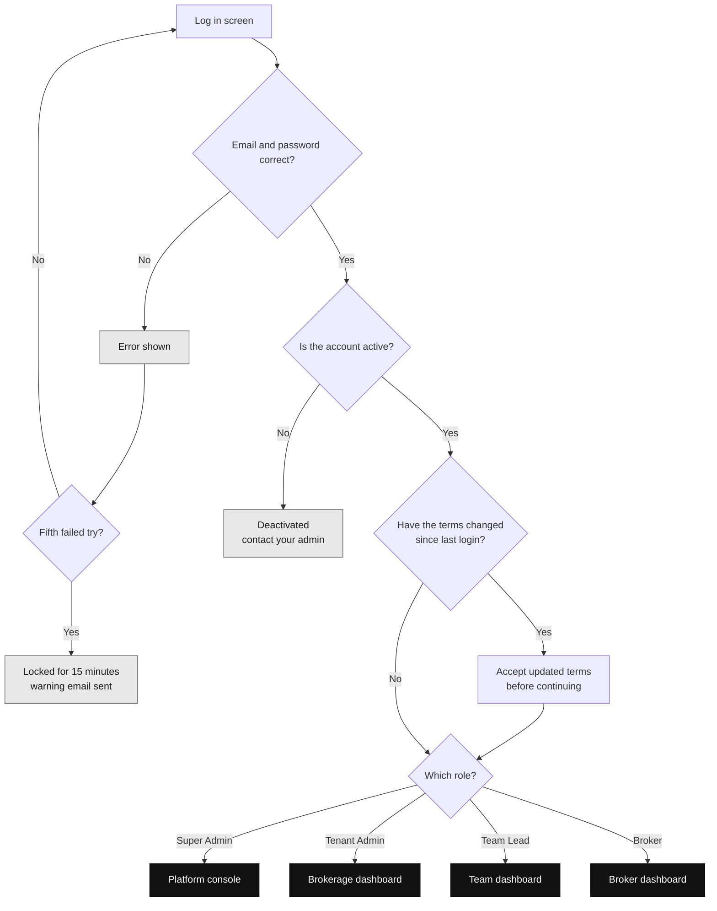
```mermaid
flowchart TD
    L["Log in screen"] --> C{"Email and password correct?"}
    C -->|No| E1["Error shown"]
    E1 --> C2{"Fifth failed try?"}
    C2 -->|Yes| LOCK["Locked for 15 minutes<br/>warning email sent"]
    C2 -->|No| L
    C -->|Yes| A{"Is the account active?"}
    A -->|No| E2["Deactivated<br/>contact your admin"]
    A -->|Yes| T{"Have the terms changed<br/>since last login?"}
    T -->|Yes| ACC["Accept updated terms<br/>before continuing"]
    ACC --> R{"Which role?"}
    T -->|No| R
    R -->|Super Admin| H1["Platform console"]
    R -->|Tenant Admin| H2["Brokerage dashboard"]
    R -->|Team Lead| H3["Team dashboard"]
    R -->|Broker| H4["Broker dashboard"]
    class LOCK,E1,E2 bad
    class H1,H2,H3,H4 good
    classDef good fill:#111111,stroke:#000000,color:#ffffff
    classDef bad fill:#e8e8e8,stroke:#5a5a5a,color:#1a1a1a
```

## Accepting an invitation

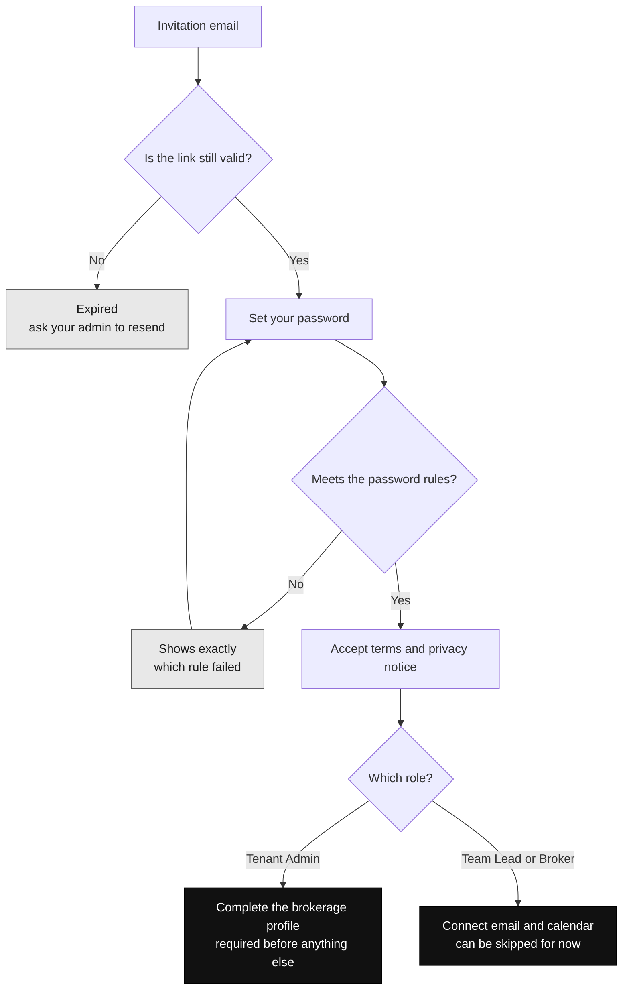
```mermaid
flowchart TD
    I["Invitation email"] --> V{"Is the link still valid?"}
    V -->|No| X["Expired<br/>ask your admin to resend"]
    V -->|Yes| S["Set your password"]
    S --> P{"Meets the password rules?"}
    P -->|No| PE["Shows exactly<br/>which rule failed"]
    PE --> S
    P -->|Yes| TC["Accept terms and privacy notice"]
    TC --> FR{"Which role?"}
    FR -->|Tenant Admin| F1["Complete the brokerage profile<br/>required before anything else"]
    FR -->|Team Lead or Broker| F2["Connect email and calendar<br/>can be skipped for now"]
    class X,PE bad
    class F1,F2 good
    classDef good fill:#111111,stroke:#000000,color:#ffffff
    classDef bad fill:#e8e8e8,stroke:#5a5a5a,color:#1a1a1a
```

## Forgotten password

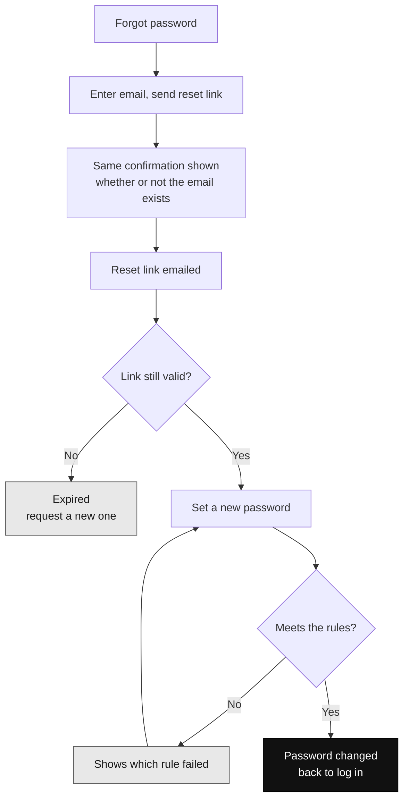
```mermaid
flowchart TD
    F["Forgot password"] --> EM["Enter email, send reset link"]
    EM --> SAME["Same confirmation shown<br/>whether or not the email exists"]
    SAME --> RL["Reset link emailed"]
    RL --> VD{"Link still valid?"}
    VD -->|No| EXP["Expired<br/>request a new one"]
    VD -->|Yes| NEW["Set a new password"]
    NEW --> OK{"Meets the rules?"}
    OK -->|No| ER["Shows which rule failed"]
    ER --> NEW
    OK -->|Yes| DONE["Password changed<br/>back to log in"]
    class EXP,ER bad
    class DONE good
    classDef good fill:#111111,stroke:#000000,color:#ffffff
    classDef bad fill:#e8e8e8,stroke:#5a5a5a,color:#1a1a1a
```

## Being logged out

| What happens                               | Result                                         |
| ------------------------------------------ | ---------------------------------------------- |
| You click Log out                          | Back to the login screen                       |
| You're inactive too long                   | Logged out automatically                       |
| Maximum session length reached             | Logged out even if you're active               |
| You revoke the session from another device | Your next click fails and you're sent to login |

---

# FLOW 1 — Super Admin

Runs the platform. Sees which brokerages exist, how much they're using, and what happened.
Never sees anyone's client records.

## The console

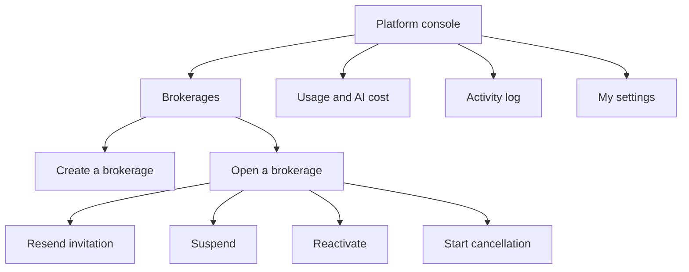
```mermaid
flowchart TD
    PC["Platform console"] --> BL["Brokerages"]
    PC --> UC["Usage and AI cost"]
    PC --> AL["Activity log"]
    PC --> ST["My settings"]
    BL --> CR["Create a brokerage"]
    BL --> BD["Open a brokerage"]
    BD --> RS["Resend invitation"]
    BD --> SU["Suspend"]
    BD --> RA["Reactivate"]
    BD --> CN["Start cancellation"]
```

If there are no brokerages yet, the console shows an empty screen with one action:
create the first one.

## Creating a brokerage

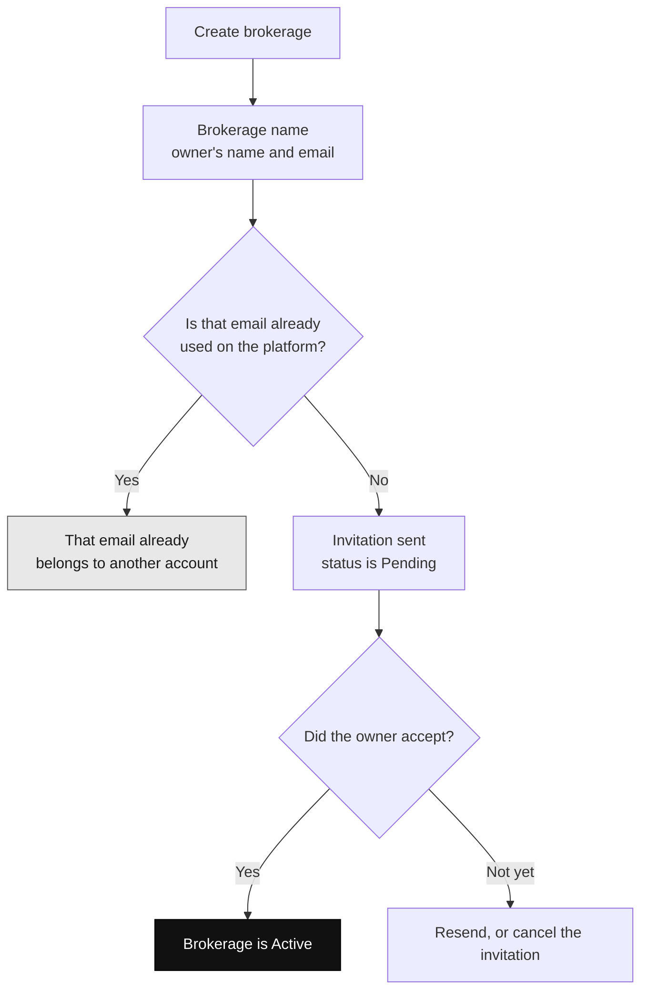
```mermaid
flowchart TD
    CR["Create brokerage"] --> DT["Brokerage name<br/>owner's name and email"]
    DT --> EM{"Is that email already<br/>used on the platform?"}
    EM -->|Yes| ER["That email already<br/>belongs to another account"]
    EM -->|No| INV["Invitation sent<br/>status is Pending"]
    INV --> ACC{"Did the owner accept?"}
    ACC -->|Yes| ACT["Brokerage is Active"]
    ACC -->|Not yet| WAIT["Resend, or cancel the invitation"]
    class ER bad
    class ACT good
    classDef good fill:#111111,stroke:#000000,color:#ffffff
    classDef bad fill:#e8e8e8,stroke:#5a5a5a,color:#1a1a1a
```

## Suspending and cancelling

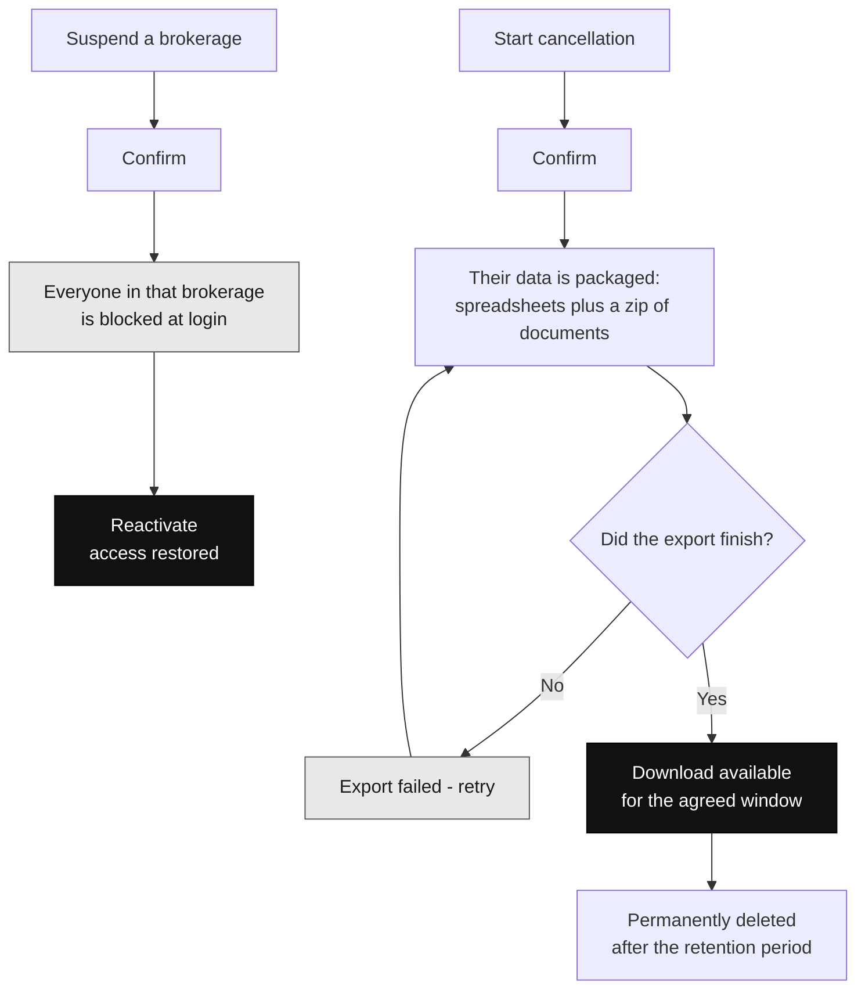
```mermaid
flowchart TD
    SU["Suspend a brokerage"] --> CF1["Confirm"]
    CF1 --> BLK["Everyone in that brokerage<br/>is blocked at login"]
    BLK --> RE["Reactivate<br/>access restored"]

    CN["Start cancellation"] --> CF2["Confirm"]
    CF2 --> PKG["Their data is packaged:<br/>spreadsheets plus a zip of documents"]
    PKG --> OK{"Did the export finish?"}
    OK -->|No| RT["Export failed - retry"]
    RT --> PKG
    OK -->|Yes| DL["Download available<br/>for the agreed window"]
    DL --> DEL["Permanently deleted<br/>after the retention period"]
    class BLK,RT bad
    class RE,DL good
    classDef good fill:#111111,stroke:#000000,color:#ffffff
    classDef bad fill:#e8e8e8,stroke:#5a5a5a,color:#1a1a1a
```

## Watching AI cost

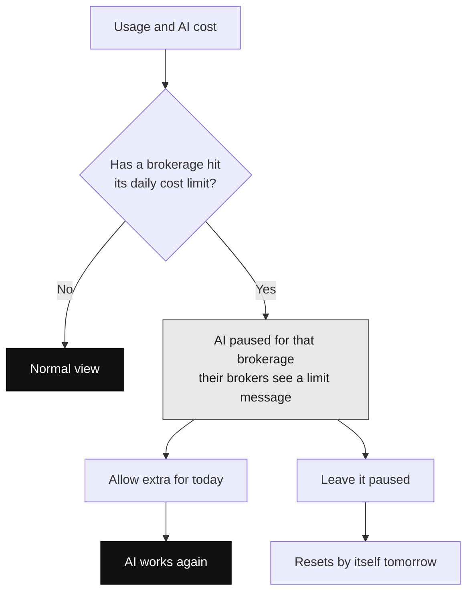
```mermaid
flowchart TD
    U["Usage and AI cost"] --> LIM{"Has a brokerage hit<br/>its daily cost limit?"}
    LIM -->|No| N["Normal view"]
    LIM -->|Yes| PA["AI paused for that brokerage<br/>their brokers see a limit message"]
    PA --> D1["Allow extra for today"]
    D1 --> RES["AI works again"]
    PA --> D2["Leave it paused"]
    D2 --> RST["Resets by itself tomorrow"]
    class PA bad
    class RES,N good
    classDef good fill:#111111,stroke:#000000,color:#ffffff
    classDef bad fill:#e8e8e8,stroke:#5a5a5a,color:#1a1a1a
```

The activity log records logins, sensitive-data reveals, downloads, deletions, admin
actions and security events. It can be filtered and exported, and the export is itself
recorded.

---

# FLOW 2 — Tenant Admin

Runs one brokerage and sees everything inside it.

## What they can reach

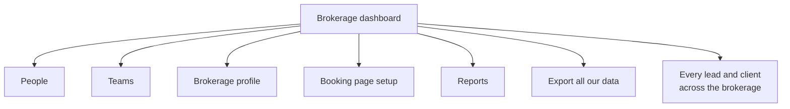
```mermaid
flowchart TD
    BDash["Brokerage dashboard"] --> PE["People"]
    BDash --> TM["Teams"]
    BDash --> BP["Brokerage profile"]
    BDash --> BK["Booking page setup"]
    BDash --> RP["Reports"]
    BDash --> EX["Export all our data"]
    BDash --> AB["Every lead and client<br/>across the brokerage"]
```

## Inviting someone

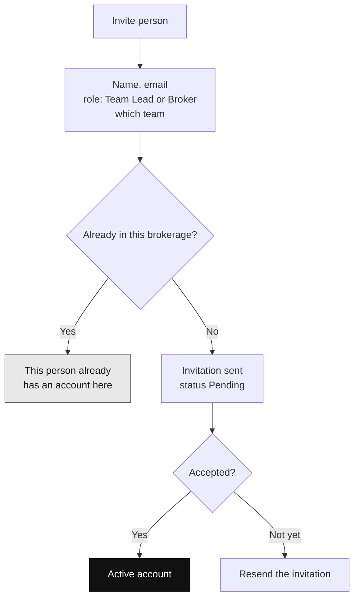
```mermaid
flowchart TD
    IV["Invite person"] --> RO["Name, email<br/>role: Team Lead or Broker<br/>which team"]
    RO --> DUP{"Already in this brokerage?"}
    DUP -->|Yes| DE["This person already<br/>has an account here"]
    DUP -->|No| SENT["Invitation sent<br/>status Pending"]
    SENT --> ACC{"Accepted?"}
    ACC -->|Yes| LIVE["Active account"]
    ACC -->|Not yet| RSD["Resend the invitation"]
    class DE bad
    class LIVE good
    classDef good fill:#111111,stroke:#000000,color:#ffffff
    classDef bad fill:#e8e8e8,stroke:#5a5a5a,color:#1a1a1a
```

## Removing someone — the important one

A person can't just be switched off. Their clients have to go somewhere first.

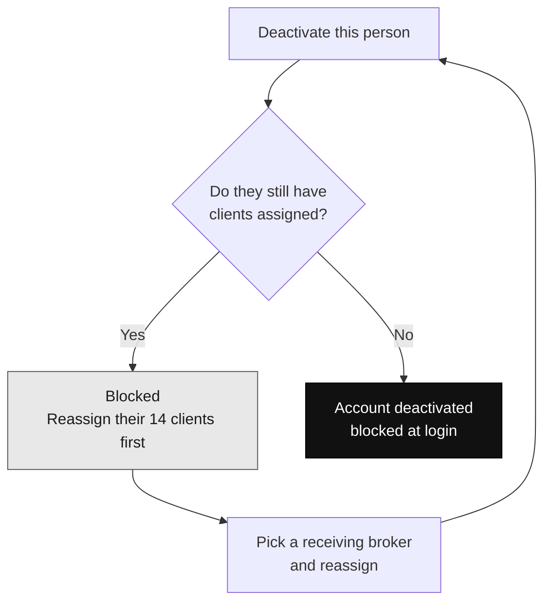
```mermaid
flowchart TD
    DA["Deactivate this person"] --> AS{"Do they still have<br/>clients assigned?"}
    AS -->|Yes| BLKD["Blocked<br/>Reassign their 14 clients first"]
    BLKD --> REA["Pick a receiving broker<br/>and reassign"]
    REA --> DA
    AS -->|No| OFF["Account deactivated<br/>blocked at login"]
    class BLKD bad
    class OFF good
    classDef good fill:#111111,stroke:#000000,color:#ffffff
    classDef bad fill:#e8e8e8,stroke:#5a5a5a,color:#1a1a1a
```

## Teams

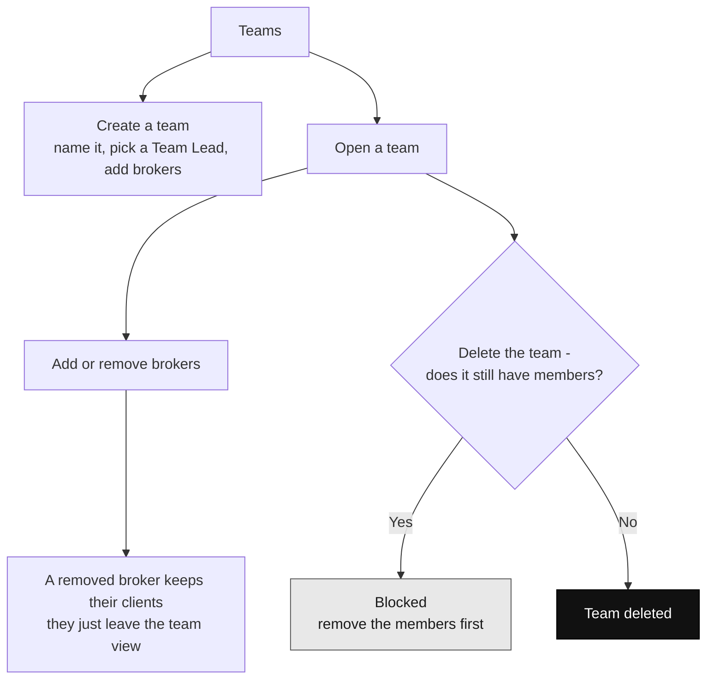
```mermaid
flowchart TD
    T["Teams"] --> CT["Create a team<br/>name it, pick a Team Lead, add brokers"]
    T --> TD["Open a team"]
    TD --> AR["Add or remove brokers"]
    AR --> KEEP["A removed broker keeps their clients<br/>they just leave the team view"]
    TD --> DLQ{"Delete the team -<br/>does it still have members?"}
    DLQ -->|Yes| NO["Blocked<br/>remove the members first"]
    DLQ -->|No| YES["Team deleted"]
    class NO bad
    class YES good
    classDef good fill:#111111,stroke:#000000,color:#ffffff
    classDef bad fill:#e8e8e8,stroke:#5a5a5a,color:#1a1a1a
```

## Reports and export

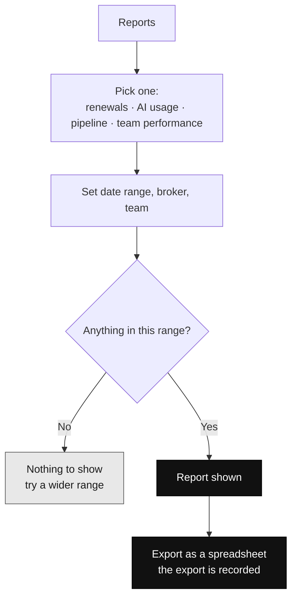
```mermaid
flowchart TD
    RP["Reports"] --> PK["Pick one:<br/>renewals · AI usage · pipeline · team performance"]
    PK --> FL["Set date range, broker, team"]
    FL --> DATA{"Anything in this range?"}
    DATA -->|No| EMP["Nothing to show<br/>try a wider range"]
    DATA -->|Yes| SHOW["Report shown"]
    SHOW --> CSV["Export as a spreadsheet<br/>the export is recorded"]
    class EMP bad
    class SHOW,CSV good
    classDef good fill:#111111,stroke:#000000,color:#ffffff
    classDef bad fill:#e8e8e8,stroke:#5a5a5a,color:#1a1a1a
```

---

# FLOW 3 — Team Lead

Does everything a broker does for their own book, plus a view across their team.
Cannot see other teams.

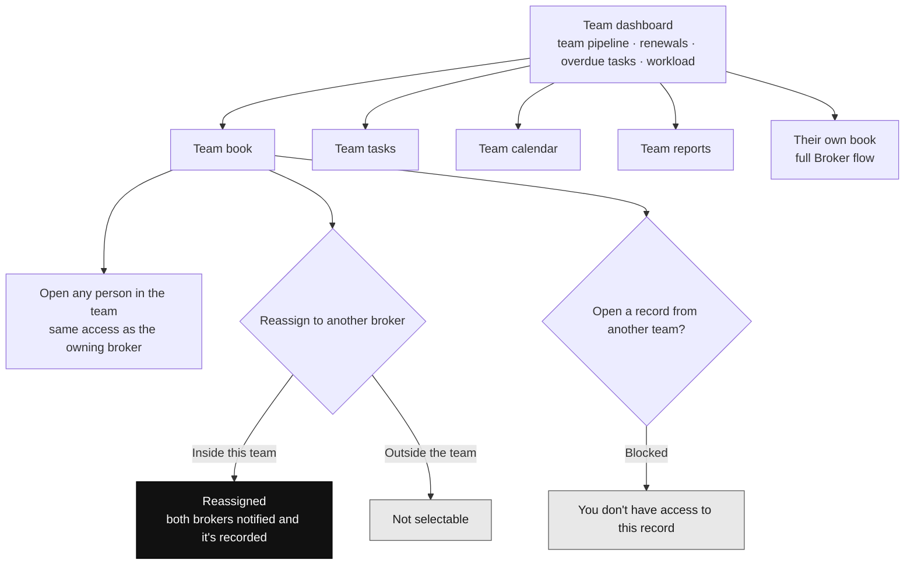
```mermaid
flowchart TD
    TDash["Team dashboard<br/>team pipeline · renewals · overdue tasks · workload"] --> TB["Team book"]
    TDash --> TT["Team tasks"]
    TDash --> TC["Team calendar"]
    TDash --> TR["Team reports"]
    TDash --> OWN["Their own book<br/>full Broker flow"]
    TB --> OPEN["Open any person in the team<br/>same access as the owning broker"]
    TB --> REQ{"Reassign to another broker"}
    REQ -->|Inside this team| OKR["Reassigned<br/>both brokers notified and it's recorded"]
    REQ -->|Outside the team| NOR["Not selectable"]
    TB --> OT{"Open a record from another team?"}
    OT -->|Blocked| DEN["You don't have access to this record"]
    class NOR,DEN bad
    class OKR good
    classDef good fill:#111111,stroke:#000000,color:#ffffff
    classDef bad fill:#e8e8e8,stroke:#5a5a5a,color:#1a1a1a
```

The workload view shows, per broker: open leads, overdue tasks, renewals within 90 days,
and files missing documents. A broker with nothing assigned is shown as empty rather than
hidden, so nobody disappears from the view.

---

# FLOW 4 — Broker

The main working role. Everything here is their own book.

## Where they can go

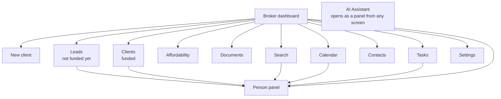
```mermaid
flowchart TD
    BD["Broker dashboard"] --> NC["New client"]
    BD --> LD["Leads<br/>not funded yet"]
    BD --> CL["Clients<br/>funded"]
    BD --> AF["Affordability"]
    BD --> DC["Documents"]
    BD --> TK["Tasks"]
    BD --> CA["Calendar"]
    BD --> CO["Contacts"]
    BD --> SR["Search"]
    BD --> SE["Settings"]
    LD --> PP["Person panel"]
    CL --> PP
    SR --> PP
    CA --> PP
    TK --> PP
    BD --> PP
    AIP["AI Assistant<br/>opens as a panel from any screen"]
```

The dashboard shows hot leads, the pipeline funnel, portfolio value, renewals, today's
meetings, follow-ups, birthdays, tasks due and overdue, missing documents, AI suggestions
and refinance opportunities. Every card is clickable and lands either on a filtered list
or straight on the person panel.

## 4.1 Adding a new person

One full form. There is no quick-add version.

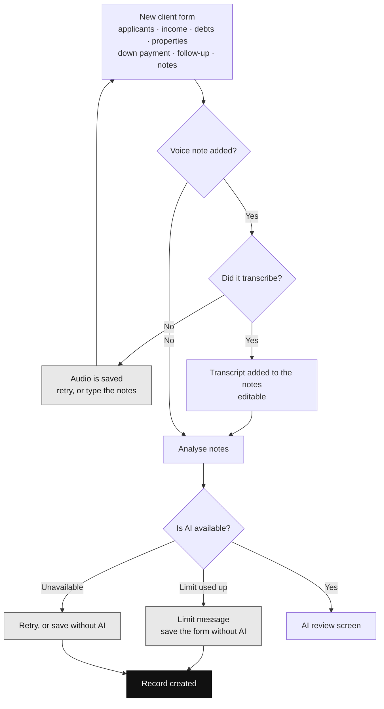
```mermaid
flowchart TD
    F["New client form<br/>applicants · income · debts · properties<br/>down payment · follow-up · notes"] --> VN{"Voice note added?"}
    VN -->|Yes| TR{"Did it transcribe?"}
    TR -->|No| TF["Audio is saved<br/>retry, or type the notes"]
    TF --> F
    TR -->|Yes| TX["Transcript added to the notes<br/>editable"]
    TX --> AN["Analyse notes"]
    VN -->|No| AN
    AN --> AV{"Is AI available?"}
    AV -->|Limit used up| L1["Limit message<br/>save the form without AI"]
    AV -->|Unavailable| L2["Retry, or save without AI"]
    AV -->|Yes| RV["AI review screen"]
    L1 --> SV["Record created"]
    L2 --> SV
    class TF,L1,L2 bad
    class SV good
    classDef good fill:#111111,stroke:#000000,color:#ffffff
    classDef bad fill:#e8e8e8,stroke:#5a5a5a,color:#1a1a1a
```

## 4.2 The AI review

Nothing AI produces is saved until the broker says so.

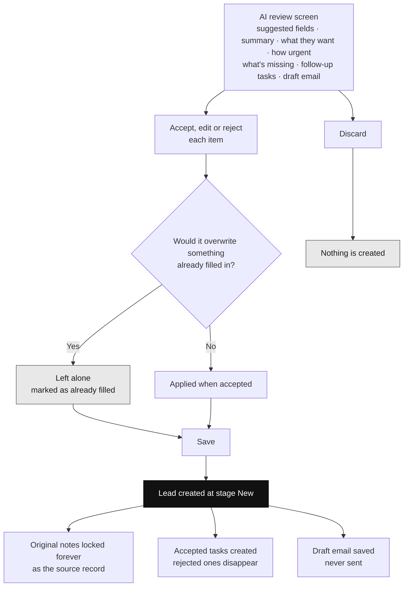
```mermaid
flowchart TD
    R["AI review screen<br/>suggested fields · summary · what they want · how urgent<br/>what's missing · follow-up tasks · draft email"] --> EA["Accept, edit or reject<br/>each item"]
    EA --> OW{"Would it overwrite something<br/>already filled in?"}
    OW -->|Yes| SK["Left alone<br/>marked as already filled"]
    OW -->|No| AP["Applied when accepted"]
    SK --> SVE["Save"]
    AP --> SVE
    SVE --> CRE["Lead created at stage New"]
    CRE --> LOCK["Original notes locked forever<br/>as the source record"]
    CRE --> TSK["Accepted tasks created<br/>rejected ones disappear"]
    CRE --> DRF["Draft email saved<br/>never sent"]
    R --> DIS["Discard"]
    DIS --> NONE["Nothing is created"]
    class NONE,SK bad
    class CRE good
    classDef good fill:#111111,stroke:#000000,color:#ffffff
    classDef bad fill:#e8e8e8,stroke:#5a5a5a,color:#1a1a1a
```

## 4.3 The person panel

Opens over whatever screen you're on — dashboard, list, calendar, task or search result.
It's the same panel everywhere.

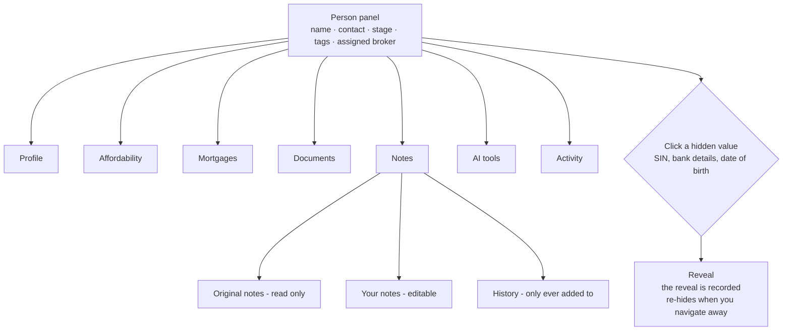
```mermaid
flowchart TD
    PP["Person panel<br/>name · contact · stage · tags · assigned broker"] --> T1["Profile"]
    PP --> T2["Affordability"]
    PP --> T3["Mortgages"]
    PP --> T4["Documents"]
    PP --> T5["Notes"]
    PP --> T6["AI tools"]
    PP --> T7["Activity"]
    T5 --> N1["Original notes - read only"]
    T5 --> N2["Your notes - editable"]
    T5 --> N3["History - only ever added to"]
    PP --> HID{"Click a hidden value<br/>SIN, bank details, date of birth"}
    HID --> RVL["Reveal<br/>the reveal is recorded<br/>re-hides when you navigate away"]
```

## 4.4 Affordability

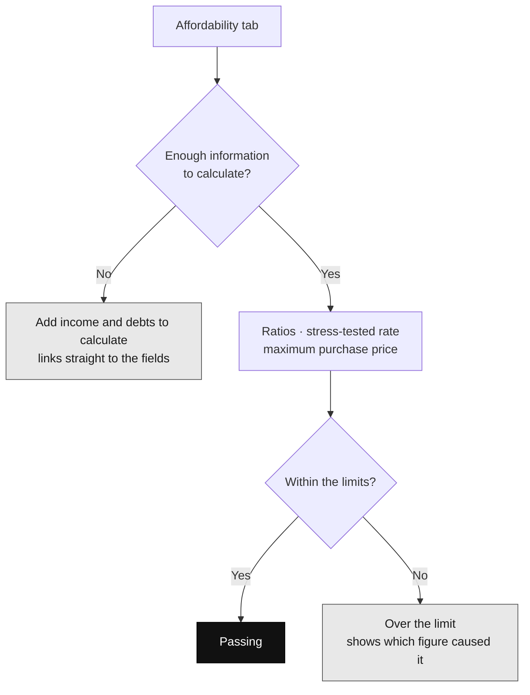
```mermaid
flowchart TD
    AF["Affordability tab"] --> EN{"Enough information<br/>to calculate?"}
    EN -->|No| MISS["Add income and debts to calculate<br/>links straight to the fields"]
    EN -->|Yes| CALC["Ratios · stress-tested rate<br/>maximum purchase price"]
    CALC --> LIM{"Within the limits?"}
    LIM -->|Yes| PASS["Passing"]
    LIM -->|No| OVER["Over the limit<br/>shows which figure caused it"]
    class MISS,OVER bad
    class PASS good
    classDef good fill:#111111,stroke:#000000,color:#ffffff
    classDef bad fill:#e8e8e8,stroke:#5a5a5a,color:#1a1a1a
```

Across the whole book there's a "Recalculate everyone" action:

```mermaid
flowchart TD
    RA["Recalculate everyone"] --> PR["Progress shown"]
    PR --> ALL{"Did every record succeed?"}
    ALL -->|Yes| OK["Done"]
    ALL -->|No| PART["38 of 41 updated<br/>the 3 failures are listed<br/>retry just those"]
    class PART bad
    class OK good
    classDef good fill:#111111,stroke:#000000,color:#ffffff
    classDef bad fill:#e8e8e8,stroke:#5a5a5a,color:#1a1a1a
```

## 4.5 Getting documents in

```mermaid
flowchart TD
    D["Documents tab"] --> TICK["Tick which documents<br/>this person needs to send"]
    D --> UP["Or upload files yourself"]
    TICK --> RQ["Request documents"]
    RQ --> EMC{"Is the broker's email connected?"}
    EMC -->|No| ALT["Connect it, or send from<br/>the system address instead"]
    EMC -->|Yes| SNT["Link emailed to the borrower"]
    ALT --> SNT
    SNT --> L7["Works for that one person only<br/>expires after 7 days"]
    L7 --> EXPD{"Expired?"}
    EXPD -->|Yes| NEWL["Generate a new link"]
    class ALT,EXPD bad
    class SNT good
    classDef good fill:#111111,stroke:#000000,color:#ffffff
    classDef bad fill:#e8e8e8,stroke:#5a5a5a,color:#1a1a1a
```

What happens to every file that arrives:

```mermaid
flowchart TD
    FL["A file arrives"] --> VS{"Virus check clean?"}
    VS -->|No| RJ["Rejected and never stored<br/>broker notified"]
    VS -->|Yes| STO["Stored securely in Canada"]
    STO --> RD{"Could the system read it?"}
    RD -->|No| FAIL["Broker notified<br/>retry, or type the values in"]
    RD -->|Partly| PARTL["Partial result flagged"]
    RD -->|Yes| REV["Review the extracted details"]
    PARTL --> REV
    REV --> PF["Accept, edit or reject each value"]
    PF --> BLKQ{"Does the field<br/>already have a value?"}
    BLKQ -->|Yes| LEAVE["Left untouched"]
    BLKQ -->|No| FILL["Filled in"]
    FILL --> UPD["Missing-documents list<br/>and dashboard update"]
    LEAVE --> UPD
    class RJ,FAIL,PARTL bad
    class UPD good
    classDef good fill:#111111,stroke:#000000,color:#ffffff
    classDef bad fill:#e8e8e8,stroke:#5a5a5a,color:#1a1a1a
```

## 4.6 Moving the deal along

```mermaid
flowchart LR
    N["New"] --> Q["Qualified"] --> A["Application"] --> U["Underwriting"] --> AP["Approved"] --> FU["Funded"]
    N --> LO["Lost"]
    Q --> LO
    A --> LO
    U --> LO
    AP --> LO
    class FU good
    class LO bad
    classDef good fill:#111111,stroke:#000000,color:#ffffff
    classDef bad fill:#e8e8e8,stroke:#5a5a5a,color:#1a1a1a
```

Funded is the moment everything changes, and it can't be done halfway:

```mermaid
flowchart TD
    S["Change the stage to Funded"] --> M["Create or confirm the mortgage<br/>lender · rate · balance · payment<br/>maturity date · property<br/><br/>This step cannot be skipped"]
    M --> SV{"Mortgage saved?"}
    SV -->|No| CAN["Stage change cancelled<br/>the person stays where they were"]
    SV -->|Yes| CLI["They become a CLIENT"]
    CLI --> MOV["Moves out of Leads<br/>and into Clients"]
    CLI --> REM["Renewal reminders set for<br/>6, 3 and 1 month before maturity"]
    class CAN bad
    class CLI,MOV,REM good
    classDef good fill:#111111,stroke:#000000,color:#ffffff
    classDef bad fill:#e8e8e8,stroke:#5a5a5a,color:#1a1a1a
```

If it doesn't work out:

```mermaid
flowchart TD
    L["Change the stage to Lost"] --> RS["Reason is required<br/>note is optional"]
    RS --> KEEP["Record stays searchable<br/>nothing is deleted"]
```

A client can hold more than one mortgage, each with its own lender and dates.

## 4.7 Sending an email

```mermaid
flowchart TD
    P["Pick the purpose<br/>follow-up · renewal · birthday<br/>documents · annual review · refinance"] --> DR{"Is AI available?"}
    DR -->|No| MAN["Write it yourself"]
    DR -->|Yes| DFT["Draft appears<br/>marked as AI-assisted"]
    DFT --> ED["Edit it freely"]
    MAN --> ED
    ED --> SD["Save draft<br/>nothing is sent"]
    ED --> SN["Send"]
    SN --> EC{"Email account connected?"}
    EC -->|No| CNX["Connect Gmail or Outlook to send"]
    EC -->|Yes| GO{"Did it send?"}
    GO -->|No| RTY["Couldn't send - retry<br/>the draft is kept"]
    GO -->|Yes| LOG["Sent from the broker's own inbox<br/>logged on the person's timeline"]
    class CNX,RTY bad
    class LOG good
    classDef good fill:#111111,stroke:#000000,color:#ffffff
    classDef bad fill:#e8e8e8,stroke:#5a5a5a,color:#1a1a1a
```

Nothing is ever sent automatically. Sending is always a deliberate click.

## 4.8 Calendar and bookings

```mermaid
flowchart TD
    AP["New appointment<br/>call · consultation · document review"] --> GC{"Google Calendar connected?"}
    GC -->|No| CRM["Stays in the CRM only<br/>with a prompt to connect"]
    GC -->|Yes| PSH{"Pushed across?"}
    PSH -->|Yes| DONE["Done"]
    PSH -->|No| QUE["Queued and retried quietly"]
    QUE --> STILL{"Still failing?"}
    STILL -->|Yes| ALERT["Reconnect your calendar"]
    STILL -->|No| DONE
    class CRM,ALERT bad
    class DONE good
    classDef good fill:#111111,stroke:#000000,color:#ffffff
    classDef bad fill:#e8e8e8,stroke:#5a5a5a,color:#1a1a1a
```

When someone books through the public booking page:

```mermaid
flowchart TD
    BK["Booking comes in"] --> DUP{"Have we seen<br/>this booking before?"}
    DUP -->|Yes| IGN["Ignored<br/>no duplicate created"]
    DUP -->|No| MT{"Does the email match<br/>someone we already have?"}
    MT -->|Yes| ATT["Appointment attached<br/>to that person"]
    MT -->|No| NEWL["A new lead is created<br/>and the appointment attached to it"]
    class IGN bad
    class ATT,NEWL good
    classDef good fill:#111111,stroke:#000000,color:#ffffff
    classDef bad fill:#e8e8e8,stroke:#5a5a5a,color:#1a1a1a
```

Reminders fire on their own: renewals at 6, 3 and 1 month; birthdays; follow-ups;
appointments at 24 hours and 1 hour. One digest arrives each morning at 9.

## 4.9 Tasks

```mermaid
flowchart TD
    T["Tasks"] --> ADD["Add a task<br/>title · person · due date · priority"]
    T --> SG{"Where did this come from?"}
    SG -->|Suggested by AI| PR["Shown as Suggested"]
    PR --> AC["Approve - becomes a real task"]
    PR --> DS["Dismiss - disappears"]
    SG -->|Created by a person| LIVE["Active straight away"]
    AC --> CMP["Tick to complete<br/>stays on the person's timeline"]
    LIVE --> CMP
    T --> ORQ{"The person was deleted?"}
    ORQ -->|Yes| UN["Shown separately as unlinked<br/>reassign it or delete it"]
    class UN,DS bad
    class CMP good
    classDef good fill:#111111,stroke:#000000,color:#ffffff
    classDef bad fill:#e8e8e8,stroke:#5a5a5a,color:#1a1a1a
```

## 4.10 The AI Assistant

```mermaid
flowchart TD
    Q["Ask in plain language<br/>Who has renewals in the next 90 days?<br/>Which files are missing tax documents?"] --> LIMQ{"Daily allowance used up?"}
    LIMQ -->|Yes| LM["Explains the limit<br/>and when it resets"]
    LIMQ -->|No| PM{"Is this within what<br/>you're allowed to see?"}
    PM -->|No| DEN["You don't have access to that"]
    PM -->|Yes| FD{"Anything matching?"}
    FD -->|No| NF["Couldn't find anything matching that"]
    FD -->|Yes| AN["Answer, with links to<br/>the records it used"]
    AN --> RO["It only reads<br/>it cannot create, change, send or delete"]
    class LM,DEN,NF bad
    class AN good
    classDef good fill:#111111,stroke:#000000,color:#ffffff
    classDef bad fill:#e8e8e8,stroke:#5a5a5a,color:#1a1a1a
```

## 4.11 Deleting someone

```mermaid
flowchart TD
    D["Delete this person"] --> CF["Type their name to confirm"]
    CF --> WR["This cannot be undone"]
    WR --> DEL["Deleted permanently<br/>recorded in the activity log"]
    class WR,DEL bad
    classDef bad fill:#e8e8e8,stroke:#5a5a5a,color:#1a1a1a
```

## 4.12 Settings

```mermaid
flowchart TD
    SE["Settings"] --> PR["My profile"]
    SE --> PW["Change password"]
    SE --> EMS["Connect email - Gmail or Outlook"]
    SE --> CALS["Connect calendar"]
    SE --> AIS["AI features on or off"]
    SE --> DV["Devices I'm signed in on"]
    EMS --> DIS["Disconnect<br/>warns you can no longer send from the CRM"]
    AIS --> OFFS["Switched off:<br/>every AI button disappears<br/>the CRM works normally without it"]
    DV --> RVK["Sign out a device<br/>takes effect immediately"]
```

---

# The same everywhere

These behave identically on every screen, in every role.

| Situation         | What the person sees                                     |
| ----------------- | -------------------------------------------------------- |
| Loading           | A skeleton of the layout, never a blank page             |
| Nothing there yet | What to do next, with the action right there             |
| Not allowed       | "You don't have access to this" — never a silent failure |
| Connection drops  | Unsaved work is kept, retry offered, nothing saved twice |
| Session expired   | Back to login, then returned to the same screen          |
| Something failed  | Plain words: what went wrong and what to try             |
| Partly failed     | Exactly how many worked, and retry for only the rest     |
