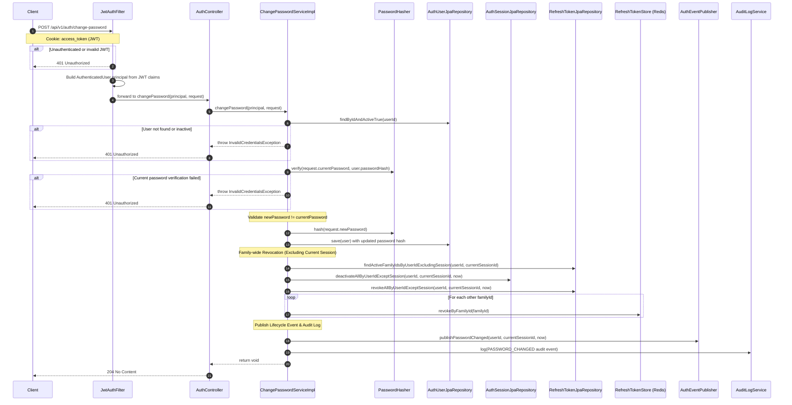

# POST `/api/v1/auth/change-password`

**File:** `api/controller/AuthController.java` → `application/impl/ChangePasswordServiceImpl.java`

Allows an authenticated user to change their password. Upon a successful password update, all active sessions and refresh tokens associated with the user across all devices/sessions are revoked—excluding the current active session, which remains active to prevent sudden session termination for the active user.

---

## Sequence diagram



---

## Step-by-step breakdown

### Step 1 — Current password verification
**Where:** `ChangePasswordServiceImpl.changePassword()`

```java
AuthUserEntity user = userRepo.findByIdAndActiveTrue(principal.getUserId())
        .orElseThrow(InvalidCredentialsException::new);

if (!passwordHasher.verify(request.currentPassword(), user.getPasswordHash())) {
    throw new InvalidCredentialsException();
}
```

**Why verify the current password first?**
Ensures that a hijacked access token cannot be used to lock a user out of their own account by changing the password. It forces proof of possession of the original credentials.

---

### Step 2 — Validation of password uniqueness
**Where:** `ChangePasswordServiceImpl.changePassword()`

```java
if (passwordHasher.verify(request.newPassword(), user.getPasswordHash())) {
    throw new PasswordSameAsOldException();
}
```

**Why enforce different passwords?**
Enforcing new password uniqueness reduces the risk of password reuse and ensures users actually rotate their secrets during password reset or change events.

---

### Step 3 — Family-wide revocation (excluding current session)
**Where:** `ChangePasswordServiceImpl.changePassword()`

```java
UUID currentSessionId = principal.getSessionId();
Instant now = Instant.now();

// 1. Fetch other active refresh token families for this user
List<UUID> otherFamilyIds = refreshTokenRepo.findActiveFamilyIdsByUserIdExcludingSession(user.getId(), currentSessionId);

// 2. Deactivate other sessions and revoke other refresh tokens in Postgres
sessionRepo.deactivateAllByUserIdExceptSession(user.getId(), currentSessionId, now);
refreshTokenRepo.revokeAllByUserIdExceptSession(user.getId(), currentSessionId, now);

// 3. Purge other active families from Redis authoritative store
otherFamilyIds.forEach(refreshTokenStore::revokeByFamilyId);
```

**Why keep the current session active?**
A user changing their password shouldn't be immediately kicked out of their current session. The family-wide revocation target-kills all *other* active devices (e.g., public terminals or stolen tokens) while ensuring a smooth, uninterrupted transition for the user who initiated the change.

---

### Step 4 — Events and Auditing
**Where:** `ChangePasswordServiceImpl.changePassword()`

```java
authEventPublisher.publishPasswordChanged(user.getId(), currentSessionId, now);

auditLogService.log(new AuditLogRequest(
        user.getTenantId(),
        user.getId(),
        "PASSWORD_CHANGED",
        null, // IP is handled by caller/filters where appropriate
        null,
        "User successfully changed their password"
));
```

**Why notify the rest of the ecosystem?**
Changing a password is a critical security lifecycle event. Publishing a `auth.password.changed` event to the `cpms.events` exchange enables downstream microservices (such as the notification service to send a confirmation email) to react immediately.

---

## Error paths

| Condition | Exception | HTTP Status |
|---|---|---|
| Current password verification fails | `InvalidCredentialsException` | 401 Unauthorized |
| New password is the same as current | `PasswordSameAsOldException` | 400 Bad Request |
| Password confirmation mismatch | Bean Validation (`@PasswordsMatch`) | 400 Bad Request |
| Strong password criteria fail | Bean Validation (`@ValidPassword`) | 400 Bad Request |

---

## Structured log keys emitted

| Key | Level | When |
|---|---|---|
| `password.change.started` | INFO | Entry |
| `password.change.invalid_current` | WARN | Wrong current password |
| `password.change.same_as_old` | WARN | New password matches old |
| `password.change.revoking_others` | INFO | Purging other sessions |
| `password.change.success` | INFO | Password changed successfully |
