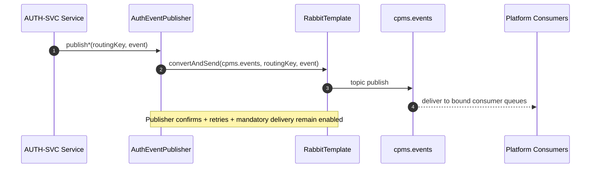

# AUTH-SVC Event Topology

**Files:** `infrastructure/messaging/constant/AuthExchangeConstants.java` → `infrastructure/messaging/constant/AuthConsumerTopologyConstants.java` → `infrastructure/messaging/config/RabbitMqConfig.java` → `infrastructure/messaging/producer/AuthEventPublisher.java`

AUTH-SVC is currently a **producer-first** service on the CPMS event bus.
It publishes authentication domain events to the shared platform exchange
`cpms.events` and does **not** currently declare any consumer queues, retries,
or DLQs at runtime.

The topology is intentionally organised so AUTH-SVC can later become a
**producer + consumer** without refactoring its publishers or renaming its
RabbitMQ conventions.

---

## Current state

### Active producer topology

**Exchange**
```
cpms.events
```

**Routing keys currently published**
- `auth.login.success`
- `auth.login.failed`
- `auth.logout`
- `auth.password.changed`
- `auth.impersonation.started`
- `auth.impersonation.ended`

**Publisher reliability still enabled**
- publisher confirms
- publisher retries
- mandatory delivery
- JSON message conversion

### Current runtime role

AUTH-SVC today:
```
AUTH-SVC
  -> cpms.events
  -> platform consumers (audit-svc, notif-svc, sup-svc, future services)
```

No AUTH-SVC-owned queues are declared at startup in the current implementation.

---

## Sequence diagram



---

## Producer constants

`AuthExchangeConstants` owns the **active producer topology**:
- exchange names
- backward-compatible exchange alias
- routing keys

This keeps all current publisher calls unchanged:
- `publishLoginSuccess()`
- `publishLoginFailed()`
- `publishLogout()`
- `publishPasswordChanged()`
- `publishImpersonationStarted()`
- `publishImpersonationEnded()`

`AUTH_EXCHANGE` is retained as a compatibility alias to `EVENTS_EXCHANGE` so
existing publisher code does not change shape.

---

## Reserved consumer topology

`AuthConsumerTopologyConstants` owns the **reserved future consumer topology**.

These constants are **not active beans today**, but define the naming conventions
AUTH-SVC will use when it begins consuming platform events.

### Reserved exchange / DLX conventions

**Shared event bus**
```
cpms.events
```

**Reserved dead-letter exchange**
```
cpms.tasks.dlx
```

### Reserved AUTH-SVC queue naming conventions

**Queue suffix**
```
.queue
```

**DLQ suffix**
```
.dlq
```

**Reserved queue families**
- `auth.tenant.events.queue`
- `auth.role.events.queue`
- `auth.user.events.queue`

**Reserved DLQ families**
- `auth.tenant.events.dlq`
- `auth.role.events.dlq`
- `auth.user.events.dlq`

### Representative future routing keys

Reserved for future bindings:
- `tenant.created`
- `tenant.updated`
- `tenant.deleted`
- `role.created`
- `role.updated`
- `role.permission.updated`
- `user.created`
- `user.updated`
- `user.deactivated`

These names are placeholders only. AUTH-SVC does not currently bind to them.

---

## Future consumer readiness

When AUTH-SVC later becomes a consumer, the intended topology is:

```
cpms.events
  -> AUTH-SVC consumer queue
  -> AUTH-SVC retry / redelivery policy
  -> AUTH-SVC DLQ on cpms.tasks.dlx
```

This can be added without modifying:
- controllers
- authentication services
- JWT logic
- session logic
- refresh-token logic
- current event publishers

Only consumer beans, bindings, and handlers would need to be introduced.

---

## Future consumer standards

### Idempotency

Planned Redis dedup convention for future consumers:

```text
SET dedup:{consumer}:{event_id} 1 EX 604800 NX
```

If the `SET ... NX` succeeds:
- process the event

If it fails:
- treat the event as already processed
- ack without duplicating side effects

### Retry and dead-lettering

Reserved future approach:
- primary queue bound to `cpms.events`
- dead-letter exchange: `cpms.tasks.dlx`
- queue-specific DLQ
- bounded retry policy before DLQ

### Event envelope

AUTH-SVC does **not** currently publish a platform-standard envelope such as:

```json
{
  "event_id": "...",
  "event_type": "...",
  "event_version": "1",
  "occurred_at": "...",
  "tenant_id": "...",
  "request_id": "...",
  "data": { ... }
}
```

Current publishers send typed event payloads directly through Spring AMQP.
Envelope standardisation remains future work and is intentionally out of scope
for the current topology-alignment change.

---

## Security and operational notes

- AUTH-SVC business flows do not depend on RabbitMQ availability.
- Publish failures are logged but do not break login, logout, refresh, password change, or magic-link flows.
- Publisher confirms and retry remain enabled to improve delivery reliability.
- Mandatory delivery remains enabled so unroutable publishes surface through the return callback.
- No consumer queues are declared today, so no AUTH-SVC-owned DLQ bean is active at startup.

---

## Structured log keys emitted

| Key | Level | When |
|---|---|---|
| `event.publish` | INFO | Before selected auth events are published |
| `event.published` | INFO | Publish completed successfully |
| `event.publish_failed` | ERROR | Publish failed after RabbitTemplate call |
| `rabbitmq.initialized` | INFO | RabbitTemplate and exchange configuration started |
| `rabbitmq.ack` | DEBUG | Broker confirm acknowledged |
| `rabbitmq.nack` | ERROR | Broker confirm negative acknowledgement |
| `rabbitmq.returned` | WARN | Mandatory publish was unroutable |

