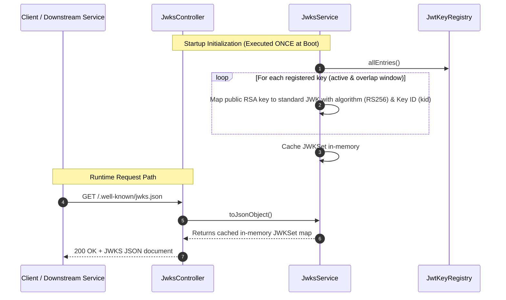

# GET `/.well-known/jwks.json`

**File:** `api/controller/JwksController.java` → `infrastructure/security/jwt/jwks/JwksService.java`

Exposes the set of public RSA keys (JSON Web Key Set) used to sign the asymmetric JWT access tokens. Other microservices within the CPMS ecosystem hit this endpoint to retrieve the public keys needed to verify access token signatures statelessly, removing the need for inter-service backchannel communication on every request.

---

## Sequence diagram



---

## Technical Details

### RS256 Asymmetric Cryptography
JWTs are signed using an asymmetric key pair:
- **Private Key**: Kept secure inside `auth-svc` (or delegates to AWS KMS) to *sign* tokens.
- **Public Key**: Shared publicly via the JWKS endpoint so that *anyone* can verify the token's validity but *no one* can forge a new token.

### Rotation Procedure & Grace Periods
To prevent platform downtime during key rotations, `auth-svc` supports overlapping public keys in its registry. The rotation workflow is as follows:
1. **Key Generation**: A new RSA key pair is generated.
2. **Registration**: The new key is added to the application properties under `jwt.keys` with its unique `kid` (Key ID), and `jwt.active-kid` is updated to point to the new key.
3. **Rollout (Dual-Key Phase)**: `auth-svc` is restarted. The JWKS document now returns **both** the old and the new public keys. Active access tokens signed by the old key continue to verify successfully because their `kid` matches the old key in the JWKS list. All newly generated tokens are signed with the new key.
4. **Deprecation**: Once the old token TTL has expired plus a safety buffer (usually 15-30 minutes), the old key is safely removed from the application configuration and another restart occurs.

---

## Sample JWKS response

```json
{
  "keys": [
    {
      "kty": "RSA",
      "use": "sig",
      "kid": "auth-key-v2",
      "alg": "RS256",
      "n": "u1W_a3X...[truncated RSA modulus]",
      "e": "AQAB"
    },
    {
      "kty": "RSA",
      "use": "sig",
      "kid": "auth-key-v1",
      "alg": "RS256",
      "n": "v8Y_b4Z...[overlapping old public key]",
      "e": "AQAB"
    }
  ]
}
```

---

## Error paths

This endpoint relies purely on pre-compiled, in-memory data structures initialized once during application startup. As a result, it is virtually immune to database, cache, or message broker outages and will execute in sub-millisecond durations with no runtime error paths under normal operation.

---

## Structured log keys emitted

| Key | Level | When |
|---|---|---|
| `jwks.initialized` | INFO | Startup creation of cached JWKSet, printing kids list |
