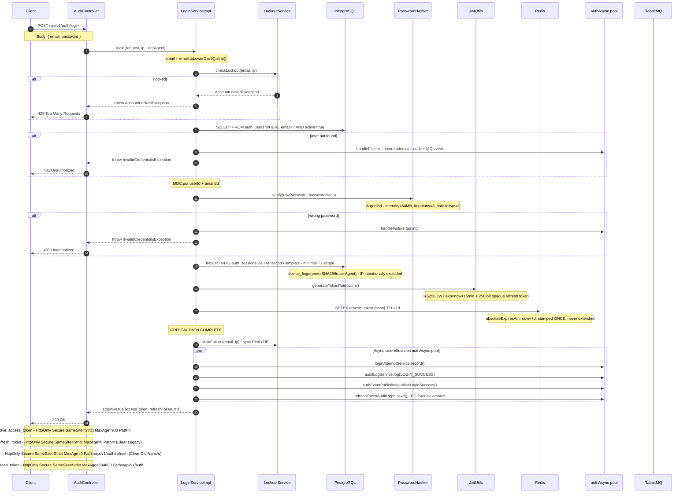

# POST `/api/v1/auth/login`

**File:** `api/controller/AuthController.java` → `application/impl/LoginServiceImpl.java`

Authenticates a user with email + password, creates a server-side session, and issues a
short-lived JWT access token plus a long-lived opaque refresh token — both delivered
exclusively via `HttpOnly` cookies.

---

## Sequence diagram



---

## Step-by-step breakdown

### Step 1 — Email normalisation
**Where:** `LoginServiceImpl.login()`

```java
String email = request.getEmail().toLowerCase().strip();
```

**Why:** Without normalisation, `User@example.com`, `user@example.com`, and ` user@example.com `
would be treated as three different users. An attacker could create a second account with a
casing variant to bypass domain-level uniqueness checks. Stripping and lowercasing at the
application layer prevents this regardless of database collation settings.

---

### Step 2 — Lockout guard
**Where:** `LockoutServiceImpl.checkLockout()`
**Redis keys:** `auth:lockout:failures:<email>:<ip>`, `auth:lockout:locked:<email>:<ip>`

```java
lockoutService.checkLockout(email, ipAddress);
// → throws AccountLockedException if locked key exists → HTTP 429
```

**Why:** Brute-force attacks enumerate passwords by making many login attempts in a short window.
The lockout guard stops this at the very first check — before any DB query — so the attack
cannot proceed even if the email is valid. The counter is scoped to `email + ip` rather than
just email so a single bad actor cannot lock out a legitimate user from a different network.

The check is synchronous and security-critical — it cannot be moved to async without
opening a race window where multiple concurrent requests all pass before the counter increments.

---

### Step 3 — User lookup
**Where:** `AuthUserJpaRepository.findByEmailAndActiveTrue(email)`

```sql
SELECT * FROM auth_users WHERE email = :email AND active = true
```

**Why read-only, no transaction?** User lookup is a pure read with no writes. Opening a
transaction for a read-only SELECT wastes a HikariCP connection-slot and adds Hibernate
session overhead. By staying outside a transaction, the lookup is faster and the connection
is returned to the pool before the password hash step (which can take 50–200 ms).

**Why same 401 for both missing user and wrong password?**
If the API returned different errors for "user not found" vs "wrong password", an attacker
could enumerate valid email addresses by observing the response. Both paths return the exact
same `401 Unauthorized` with the same body — user enumeration is impossible.

---

### Step 4 — MDC enrichment
**Where:** `LoginServiceImpl.login()`

```java
MDC.put("userId",   user.getId().toString());
MDC.put("tenantId", user.getTenantId().toString());
try {
    return executeLogin(...);
} finally {
    MDC.remove("userId");
    MDC.remove("tenantId");
}
```

**Why:** MDC (Mapped Diagnostic Context) automatically attaches `userId` and `tenantId` to
every log line emitted for the rest of this request's execution, without needing to pass
them through every method signature. This makes it trivial to correlate all logs for a
single login attempt in production.

The `finally` block is critical. Without it, virtual threads or pooled threads reuse the
same thread-local storage for the next request, leaking another user's `userId` into
unrelated log lines.

---

### Step 5 — Argon2id password verification
**Where:** `PasswordHasher.verify()` → `Argon2PasswordEncoder.matches()`

```
Parameters: memory=64MB, iterations=3, parallelism=1
```

**Why Argon2id?** It is the winner of the Password Hashing Competition (2015) and is
recommended by OWASP as the first choice for password hashing. It is memory-hard
(requires 64 MB RAM per attempt) which makes GPU/ASIC-based parallel cracking
economically infeasible — each attempt costs real RAM, not just CPU cycles.
`bcrypt` and `PBKDF2` are CPU-bound only and can be parallelised cheaply on modern GPUs.

This is the primary performance bottleneck in the login path (typically 50–200 ms).
All other steps are engineered to minimise time spent outside this step.

---

### Step 6 — Session persistence (minimal TX scope)
**Where:** `LoginServiceImpl.executeLogin()` → `TransactionTemplate`

```java
txTemplate.executeWithoutResult(status -> {
    sessionRepo.save(AuthSessionMapper.toEntity(...));
});
```

**Why `TransactionTemplate` instead of `@Transactional`?**
`@Transactional` on the login method would open the DB transaction at step 1 and hold it
open through the Argon2 hash (50–200 ms). That wastes a HikariCP connection for 50–200 ms
doing nothing. `TransactionTemplate` scopes the transaction to exactly the one write,
so the connection is held for < 5 ms.

**Why is IP excluded from device fingerprint?**
```java
String deviceFingerprint = RefreshTokenHashUtil.hash(userAgent != null ? userAgent : "unknown");
```
IP addresses change on mobile networks (cell tower handoffs), VPN reconnects, and IPv4/IPv6
dual-stack transitions. Including IP in the fingerprint would cause legitimate users to appear
as different devices on every network change. User-Agent is a stable browser-bound signal.

---

### Step 7 — JWT pair generation
**Where:** `JwtUtils.generateTokenPair()`

**Access token:**
```
Algorithm: RS256 (RSA + SHA-256)
Claims: sub, iss, iat, exp (now+15min), jti (sessionId),
        tenant_id, role_id, permissions_hash, user_type, session_id, kid
```

**Refresh token:**
```java
byte[] random = new byte[32];
new SecureRandom().nextBytes(random);
token = Base64.getUrlEncoder().withoutPadding().encodeToString(random);
// → 256-bit cryptographically random URL-safe string
```

**Why RS256 and not HS256?** RS256 uses asymmetric keys: the private key signs tokens
(held only by auth-svc), and the public key verifies them (distributed via `/.well-known/jwks.json`).
Any downstream service can verify tokens without needing the signing secret.
With HS256 (symmetric), every verifying service would hold the same secret — a leak
from any one service compromises the entire platform.

**Why opaque refresh token instead of a second JWT?**
JWTs are stateless — once issued, they cannot be revoked before their `exp` claim expires.
An opaque token is just a random blob; its validity is determined by looking it up in Redis.
This gives instant revocability: deleting the Redis key immediately invalidates the session.

---

### Step 8 — Redis refresh-token write (absolute session boundary stamped here)
**Where:** `LoginServiceImpl.executeLogin()` → `RefreshTokenStore.save()`

```java
refreshTokenStore.save(RefreshToken.builder()
    ...
    .expiresAt(tokenPair.refreshTokenExpiry())          // = now + 7d
    .absoluteExpiresAt(tokenPair.refreshTokenExpiry())  // = now + 7d — stamped ONCE
    .build());
```

**Why two expiry fields?**
`expiresAt` will shrink with each rotation (remaining window). `absoluteExpiresAt` is the
hard boundary stamped at login and **never changed**. At each rotation, the system computes
`remainingTtl = absoluteExpiresAt - now`. When `remainingTtl ≤ 0` the session is terminated
regardless of activity. Without this, a user who refreshes frequently has an effectively
immortal session that never expires.

**Why Redis as authoritative store (not Postgres)?**
Redis is an in-memory store with sub-millisecond reads. Token validation on every refresh
request needs to be fast. Postgres would add 5–20 ms per lookup due to disk I/O, connection
overhead, and SQL parsing. Redis also handles TTL-based expiry natively without cron jobs.

---

### Step 9 — Async side-effects
**Where:** `LoginServiceImpl.executeLogin()` → `authAsync` executor pool

The following are dispatched after Redis write and never block the response:

| Task | Mechanism | Why async? |
|---|---|---|
| `loginAttemptService.record()` | `@Async("authAsync")` | DB insert — not on critical path |
| `auditLogService.log("LOGIN_SUCCESS")` | `@Async("authAsync")` | DB insert — not on critical path |
| `authEventPublisher.publishLoginSuccess()` | explicit `executor.execute()` | RabbitMQ latency must never block login |
| `refreshTokenAuditRepo.save()` | explicit `executor.execute()` | PG forensic archive — write-only |

The explicit `executor.execute()` wrapping for RabbitMQ is intentional: unlike `@Async`,
it catches and logs exceptions without propagating them. A RabbitMQ outage must never cause
a login failure.

---

### Step 10 — Response + cookie assembly
**Where:** `AuthController.login()`

```
Response body: { userId, email, tenantId, accessTokenExpiresAt }
Set-Cookie: access_token=<JWT>;     HttpOnly; Secure; SameSite=Strict; Path=/;                  MaxAge=900
Set-Cookie: refresh_token=;         HttpOnly; Secure; SameSite=Strict; Path=/;                  MaxAge=0 (Clear Legacy)
Set-Cookie: refresh_token=;         HttpOnly; Secure; SameSite=Strict; Path=/api/v1/auth/refresh; MaxAge=0 (Clear Old Narrow)
Set-Cookie: refresh_token=<opaque>; HttpOnly; Secure; SameSite=Strict; Path=/api/v1/auth;         MaxAge=604800
```

**Why tokens only in cookies, never in the body?**
Tokens in the response body are accessible to JavaScript (`fetch().then(r => r.json())`).
This means any XSS vulnerability can steal tokens. `HttpOnly` cookies are completely
inaccessible to JavaScript — the browser sends them automatically but JS cannot read them.

**Why `SameSite=Strict`?** Prevents the cookies from being sent on any cross-origin request.
This provides CSRF protection without needing a separate CSRF token — the attacker's page
cannot trigger a state-changing request because the browser will not attach the cookies.

**Why does `refresh_token` use `Path=/api/v1/auth`?**
Scoping the refresh cookie to `/api/v1/auth` allows both the `/refresh` endpoint (at `/api/v1/auth/refresh`) and the `/logout` endpoint (at `/api/v1/auth/logout`) to receive it. Scoping it more narrowly to `/api/v1/auth/refresh` would prevent the logout endpoint from receiving the refresh token cookie, making client-initiated server-side session revocation impossible.

**Why clear old cookies?**
Older implementations stored the refresh token cookie at different paths (`/` and `/api/v1/auth/refresh`). Sending explicit clearing cookies (Max-Age=0) for those legacy paths ensures the browser doesn't retain shadowed or duplicate cookies, which could trigger false replay-attack detections.

---

## Error paths

| Condition | Class | HTTP |
|---|---|---|
| Account locked (≥5 failures in 15 min) | `AccountLockedException` | 429 |
| User not found | `InvalidCredentialsException` | 401 |
| Wrong password | `InvalidCredentialsException` | 401 |
| Bean Validation failure (`@Valid`) | `MethodArgumentNotValidException` | 400 |
| Unexpected server error | `Exception` | 500 |

Both "user not found" and "wrong password" intentionally return identical 401 responses
to prevent user enumeration.

---

## Structured log keys emitted

| Key | Level | When |
|---|---|---|
| `login.started` | INFO | Entry |
| `perf.login.user_lookup.ms` | INFO | After DB lookup |
| `login.user_not_found` | WARN | User missing |
| `login.password_invalid` | WARN | Wrong password |
| `perf.login.password_verify.ms` | INFO | After Argon2 |
| `perf.login.tx_conn_acquired.ms` | INFO | Transaction started |
| `perf.login.session_persist.ms` | INFO | Session row inserted |
| `perf.login.session_save_total.ms` | INFO | Full TX duration |
| `perf.login.jwt_generate.ms` | INFO | After JWT generation |
| `perf.login.redis_store.ms` | INFO | After Redis write |
| `session.absolute_expiry` | INFO | Absolute expiry stamped |
| `login.success` | INFO | Critical path complete |
| `perf.login.critical_path.ms` | INFO | Total critical-path latency |
