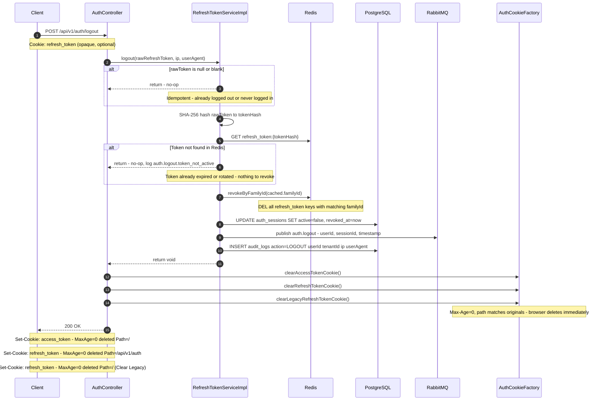

# POST `/api/v1/auth/logout`

**File:** `api/controller/AuthController.java` → `application/impl/RefreshTokenServiceImpl.java`

Explicitly terminates the current session. Revokes the entire token family in Redis,
deactivates the server-side session in Postgres, clears both auth cookies from the browser,
publishes an `auth.logout` lifecycle event to RabbitMQ, and writes an audit entry.

This endpoint is **fully idempotent** — calling it multiple times (or with no token at all)
always succeeds with `204 No Content`. The client cannot get into a broken state by calling
it twice.

---

## Sequence diagram



---

## Step-by-step breakdown

### Step 1 — Idempotency for missing token
**Where:** `RefreshTokenServiceImpl.logout()` — entry guard

```java
if (rawToken == null || rawToken.isBlank()) {
    log.debug("auth.logout.no_token ip={}", ipAddress);
    return; // idempotent — nothing to revoke
}
```

**Why accept null without error?**
The `refresh_token` cookie is sent as `required = false` in the controller:
```java
@CookieValue(name = AuthCookieFactory.REFRESH_TOKEN_COOKIE, required = false)
String rawRefreshToken,
```

A client that has already logged out (cookies already cleared) should be able to call
`/logout` again without getting a 4xx error — there is no token to revoke, but the intent
(being logged out) is already satisfied. Returning `204` is semantically correct.

This design also handles clients that call `/logout` after their refresh token has already
expired. The user wants to be logged out; there is no need to punish them for a correctly
expired token.

---

### Step 2 — Redis lookup before doing any work
**Where:** `RefreshTokenStore.findByTokenHash(tokenHash)`

```java
var cachedOpt = refreshTokenStore.findByTokenHash(tokenHash);
if (cachedOpt.isEmpty()) {
    log.info("auth.logout.token_not_active ip={}", ipAddress);
    return; // already expired or rotated — idempotent
}
```

**Why check Redis first?**
The hash is computed, but if the token is not in Redis (already expired or already revoked),
there is nothing to revoke. Returning early avoids unnecessary Postgres reads and writes.
This also handles the case where the client had a stale cookie from a session that was
terminated server-side (e.g., by an administrator, or by a replay attack response).

---

### Step 3 — Family-wide revocation
**Where:** `RefreshTokenStore.revokeByFamilyId(cached.getFamilyId())`

```java
refreshTokenStore.revokeByFamilyId(cached.getFamilyId());
log.info("refresh.family_revoked familyId={} reason=logout", cached.getFamilyId());
```

**Why revoke the entire family, not just the presented token?**
A single login session produces a "token family" — a chain of rotations all sharing the same
`familyId`. If a user is logged in on a device and explicitly logs out, they expect ALL tokens
from that session to be invalidated — including any token that was issued in a rotation
(e.g., if the browser had an in-flight refresh request in parallel with the logout).

Revoking only the presented token would leave intermediate rotations in Redis as valid
credentials. The family-wide approach provides complete, race-condition-free session termination.

---

### Step 4 — Session deactivation
**Where:** `AuthSessionJpaRepository.findById(cached.getSessionId()).ifPresent(...)`

```java
sessionRepo.findById(cached.getSessionId()).ifPresent(s -> {
    s.setActive(false);
    s.setRevokedAt(now);
    sessionRepo.save(s);
    log.info("session.revoked sessionId={} reason=logout", s.getId());
});
```

**Why deactivate the Postgres session?**
Redis revocation immediately prevents new token rotations. But the `GET /session` endpoint
also validates the Postgres session row (`active=true`). Without deactivating the DB session,
a user with a currently-live JWT (up to 15 minutes of remaining validity) could still call
`/session` successfully after logout.

Setting `active=false` + `revokedAt=now` ensures:
1. `/session` returns 401 immediately for any request after this point
2. The session appears in admin tooling as "revoked" with an accurate timestamp
3. The `revokedAt` column provides forensic evidence of when the session ended

---

### Step 5 — `auth.logout` event publishing
**Where:** `AuthEventPublisher.publishLogout(cached.getUserId(), cached.getSessionId())`

```java
authEventPublisher.publishLogout(cached.getUserId(), cached.getSessionId());
```

**Event published to RabbitMQ:**
```
Exchange:    cpms.auth.exchange (topic)
Routing key: auth.logout
Payload:     LogoutEvent { userId, sessionId, timestamp }
```

**Why publish an event on logout?**
Logout has downstream effects that auth-svc should not need to know about directly.
Instead of auth-svc calling every dependent service, it publishes a single event that
interested consumers react to:

| Consumer | What it does on `auth.logout` |
|---|---|
| `audit-svc` | Archives the logout event with full context |
| `notif-svc` | Optionally notifies the user of session termination (e.g., security email) |
| `search-svc` | Can invalidate any user-scoped search caches |

This is the **event-driven revocation** pattern. The event is published in four separate
termination paths (explicit logout, natural expiry, absolute boundary, replay attack) so
consumers receive a consistent signal regardless of why the session ended.

---

### Step 6 — Audit log
**Where:** `AuditLogService.log()`

```java
auditLogService.log(new AuditLogRequest(
        cached.getTenantId(), cached.getUserId(), "LOGOUT",
        ipAddress, userAgent, "sessionId=" + cached.getSessionId()));
```

**Why record an audit entry for logout?**
Security audits and compliance frameworks (SOC 2, ISO 27001) require an audit trail of all
session lifecycle events — not just logins. The audit log records who logged out, when,
from which IP and user agent, and which session was terminated. This is essential for:
- Investigating suspected account compromise ("was the session terminated by the user or by an attacker?")
- Regulatory compliance requiring proof of session termination

---

### Step 7 — Cookie clearing
**Where:** `AuthController.logout()` → `AuthCookieFactory.clearAccessTokenCookie()`, `.clearRefreshTokenCookie()`, and `.clearLegacyRefreshTokenCookie()`

```java
return ResponseEntity.ok()
        .header(HttpHeaders.SET_COOKIE, cookieFactory.clearAccessTokenCookie().toString())
        .header(HttpHeaders.SET_COOKIE, cookieFactory.clearRefreshTokenCookie().toString())
        .header(HttpHeaders.SET_COOKIE, cookieFactory.clearLegacyRefreshTokenCookie().toString())
        .body(LogoutResponse.success()); // HTTP 200 OK
```

**Why HTTP 200 OK with custom body?**
The endpoint returns `200 OK` with a structured `LogoutResponse.success()` body `{ "success": true }` to explicitly confirm the successful logout to client applications.

**Why clear cookies regardless of whether the token was found?**
Even when the logout is a no-op (token already expired or null), the response always clears the cookies. This ensures the client's browser state (cookie jar) is always clean after a logout call, regardless of the server state. A client that calls logout twice will have its cookies cleared both times.

**How cookie clearing works:**
```
Set-Cookie: access_token=;  Path=/;             Max-Age=0; HttpOnly; Secure; SameSite=Strict
Set-Cookie: refresh_token=; Path=/api/v1/auth;   Max-Age=0; HttpOnly; Secure; SameSite=Strict
Set-Cookie: refresh_token=; Path=/;             Max-Age=0; HttpOnly; Secure; SameSite=Strict (Clear Legacy)
```

`Max-Age=0` instructs the browser to immediately delete the cookie. The `Path` and domain attributes must match the original `Set-Cookie` header exactly — if they do not match, the browser treats them as different cookies and the originals are not deleted.

---

## Idempotency matrix

| Scenario | Server action | HTTP response |
|---|---|---|
| Valid token, active session | Revoke family, deactivate session, publish event, write audit | 200 |
| Token not in Redis (expired / already revoked) | No-op | 200 |
| Null or blank token cookie | No-op | 200 |
| No `refresh_token` cookie at all | No-op | 200 |
| Token in Redis, session already `active=false` | Revoke Redis family, skip session update (`ifPresent` handles), publish event | 200 |

In all cases, cookies are cleared in the response.

---

## Error paths

This endpoint intentionally has no error paths visible to the client. Any unexpected server
error (Redis unavailable, Postgres unavailable) will return `500`, but:
- The cookies are cleared client-side regardless (browser already processed the response if it arrived)
- The user's intent (being logged out) should survive infrastructure failures where possible

The service method returns `void` — the controller does not propagate service exceptions
to the client beyond a generic `500`.

---

## Structured log keys emitted

| Key | Level | When |
|---|---|---|
| `auth.logout.no_token` | DEBUG | Null/blank cookie — no-op |
| `auth.logout.token_not_active` | INFO | Token not found in Redis — no-op |
| `refresh.family_revoked reason=logout` | INFO | Redis family revoked |
| `session.revoked reason=logout` | INFO | Postgres session deactivated |
| `auth.logout` | INFO | Full logout complete (userId, sessionId, ip) |
