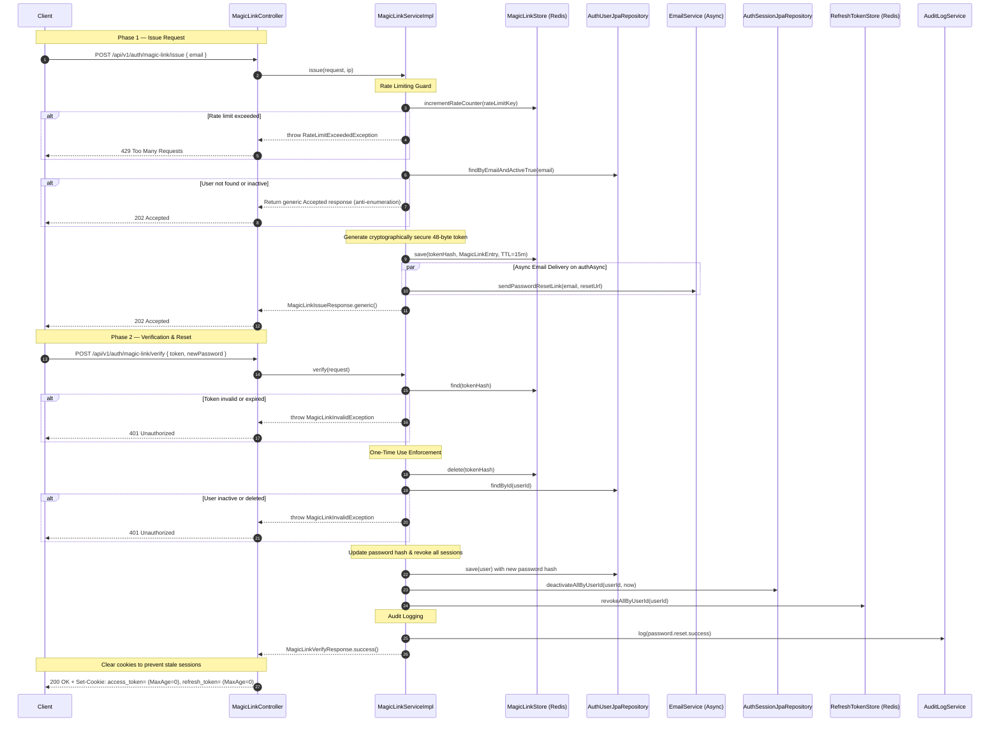

# Magic Link Reset Flow

**File:** `api/controller/MagicLinkController.java` → `application/impl/MagicLinkServiceImpl.java`

Handles the public, password-reset flow via a temporary, cryptographically secure magic link.

- `POST /api/v1/auth/magic-link/issue` generates a secure reset token and emails it to the user.
- `POST /api/v1/auth/magic-link/verify` validates the token, resets the password, terminates all other sessions, and clears browser cookies.

---

## Sequence diagram



---

## Step-by-step breakdown

### Step 1 — Rate limiting guard
**Where:** `MagicLinkServiceImpl.issue()`

```java
String rateLimitKey = ip + ":" + RefreshTokenHashUtil.hash(normalizedEmail);
long attempts = magicLinkStore.incrementRateCounter(rateLimitKey, props.getRateLimitWindow());
if (attempts > props.getRateLimitMaxRequests()) {
    throw new RateLimitExceededException("Too many password reset requests. Please try again later.");
}
```

**Why rate limit?**
Prevents attackers from brute-forcing emails or exhausting SMTP/SES sending quotas by repeatedly requesting reset links.

---

### Step 2 — Silent rejection of unknown emails
**Where:** `MagicLinkServiceImpl.issue()`

```java
var userOpt = userRepo.findByEmailAndActiveTrue(normalizedEmail);
if (userOpt.isEmpty()) {
    log.info("magic_link.issue.ignored_unknown_email");
    return MagicLinkIssueResponse.generic();
}
```

**Why return 202 Accepted even if the user does not exist?**
Prevents account enumeration. If the system returned a 404 error, an attacker could input a list of emails to discover which addresses are registered on the platform. A uniform 202 Accepted response keeps registration details private.

---

### Step 3 — Secure token generation & Redis mapping
**Where:** `MagicLinkServiceImpl.issue()`

```java
byte[] rawBytes = new byte[TOKEN_BYTES]; // 48 bytes
SECURE_RANDOM.nextBytes(rawBytes);
String rawToken = URL_ENCODER.encodeToString(rawBytes);
String tokenHash = RefreshTokenHashUtil.hash(rawToken);

Instant expiresAt = Instant.now().plus(props.getTtl()); // default 15m
MagicLinkEntry entry = new MagicLinkEntry(
        user.getId(),
        user.getTenantId(),
        MagicLinkEntry.PURPOSE_PASSWORD_RESET,
        expiresAt
);
magicLinkStore.save(tokenHash, entry, props.getTtl());
```

**Why store the hash in Redis, not the raw token?**
If the Redis database is ever compromised, the attacker must not be able to read active reset links. Hashing the token via SHA-256 before storage ensures that even a database dump does not expose usable credentials.

---

### Step 4 — One-Time use enforcement (deleting token on read)
**Where:** `MagicLinkServiceImpl.verify()`

```java
String tokenHash = RefreshTokenHashUtil.hash(request.token());
var entryOpt = magicLinkStore.find(tokenHash);
if (entryOpt.isEmpty()) {
    throw new MagicLinkInvalidException();
}

// Immediately delete the token — prevents replay attacks on the reset link
magicLinkStore.delete(tokenHash);
```

**Why delete the token immediately?**
Magic links must be strictly single-use. Deleting the token from Redis *before* proceeding with password hashing guarantees that even if a subsequent step fails or the connection breaks, the same magic link cannot be re-used.

---

### Step 5 — Session and Cookie Cleansing
**Where:** `MagicLinkServiceImpl.verify()` → `MagicLinkController.verify()`

```java
// Service layer: Revokes all active database sessions and active refresh tokens
sessionRepo.deactivateAllByUserId(userId, Instant.now());
refreshTokenStore.revokeAllByUserId(userId);

// Controller layer: Clear existing access and refresh cookies
return ResponseEntity.ok()
        .header(HttpHeaders.SET_COOKIE, cookieFactory.clearAccessTokenCookie().toString())
        .header(HttpHeaders.SET_COOKIE, cookieFactory.clearRefreshTokenCookie().toString())
        .body(response);
```

**Why perform a complete session flush?**
When a password is reset, all active browser sessions across all devices are immediately compromised or invalid. Forcing server-side session termination and clearing browser-level cookies ensures absolute security alignment across all client platforms.

---

## Error paths

| Condition | Exception | HTTP Status |
|---|---|---|
| Rate limit exceeded | `RateLimitExceededException` | 429 Too Many Requests |
| Magic link token expired or unknown | `MagicLinkInvalidException` | 401 Unauthorized |
| User inactivated during window | `MagicLinkInvalidException` | 401 Unauthorized |
| Passwords do not match | Bean Validation (`@PasswordsMatch`) | 400 Bad Request |
| Weak new password criteria | Bean Validation (`@ValidPassword`) | 400 Bad Request |

---

## Structured log keys emitted

| Key | Level | When |
|---|---|---|
| `magic_link.issue.request` | DEBUG | Issue endpoint entry |
| `magic_link.rate_limited` | WARN | Rate limit tripped |
| `magic_link.issue.ignored_unknown_email` | INFO | Silently ignoring missing user |
| `magic_link.issued` | INFO | Token successfully mapped in Redis |
| `magic_link.invalid` | INFO | Unknown or modified token during verify |
| `magic_link.expired` | INFO | Token TTL exceeded |
| `magic_link.user_not_found_or_inactive` | INFO | User was deactivated since issuance |
| `password.reset.success` | INFO | Password reset complete, auditing |
