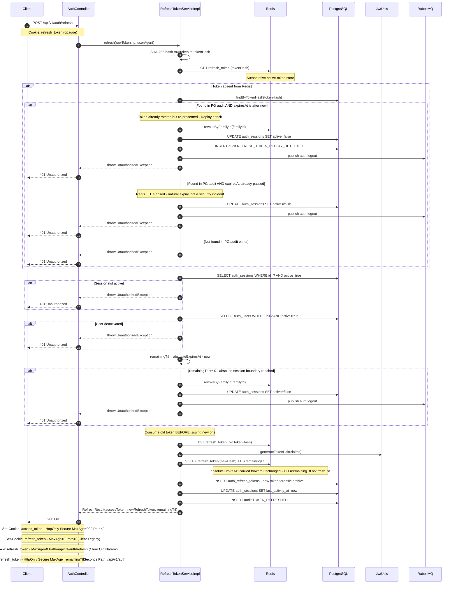

# POST `/api/v1/auth/refresh`

**File:** `api/controller/AuthController.java` → `application/impl/RefreshTokenServiceImpl.java`

Rotates the opaque refresh token and re-issues both cookies. Each rotation atomically
consumes the old token and writes a new one in Redis. The **absolute session boundary**
(`absoluteExpiresAt`) stamped at login is carried forward unchanged — the session cannot
extend beyond its original 7-day window no matter how frequently the user is active.

---

## Sequence diagram



---

## Step-by-step breakdown

### Step 1 — Token hashing
**Where:** `RefreshTokenHashUtil.hash(rawToken)`

```java
String tokenHash = RefreshTokenHashUtil.hash(rawToken);
// → SHA-256 hex of the raw token
```

**Why hash before storing or looking up?**
The raw refresh token is a bearer credential — whoever holds it can use it. Storing or
logging the raw value would mean a database dump or log file leak could be used to hijack
active sessions. By storing only the hash, the raw token never appears on disk or in logs.
SHA-256 is sufficient here (not Argon2) because the token already has 256 bits of entropy
from `SecureRandom` — there is nothing to gain from a slow hash against brute-force.

---

### Step 2 — Redis lookup (authoritative source)
**Where:** `RefreshTokenStore.findByTokenHash(tokenHash)`

```java
var cachedOpt = refreshTokenStore.findByTokenHash(tokenHash);
```

**Why Redis and not Postgres?**
Redis is the single source of truth for active tokens. This design gives two properties:
1. Instant revocation — deleting the Redis key immediately invalidates the token
2. Fast validation — sub-millisecond lookup vs 5–20 ms for a Postgres query

Postgres holds a write-only audit trail used only for forensics. Active token state is
never read from Postgres.

---

### Step 3 — Absent-token handling: replay vs natural expiry
**Where:** `RefreshTokenServiceImpl.refresh()` — `cachedOpt.isEmpty()` branch

This is the most nuanced part of the refresh flow. When a token is not found in Redis,
it means either:

**Case A — Replay attack (security incident)**
```
Token was rotated in a prior request → removed from Redis
Attacker replays the OLD token BEFORE it expired
→ Old tokenHash exists in PG audit with expiresAt > now
```

```java
if (auditRecord.getExpiresAt().isAfter(now)) {
    handleReplayAttack(auditRecord, ip, userAgent);
}
```

`handleReplayAttack` performs a "scorched-earth" response:
1. Revoke the **entire token family** from Redis — not just the presented token
2. Deactivate the session in Postgres
3. Write a `REFRESH_TOKEN_REPLAY_DETECTED` audit entry
4. Publish `auth.logout` event to RabbitMQ

**Why revoke the entire family, not just the presented token?**
The token family (all rotations sharing the same `familyId`) represents a single session
across all its rotations. If token generation-5 is replayed, the attacker may already have
used generation-6 (the current valid token) to obtain generation-7. Revoking all of them
in Redis terminates every concurrent attacker path simultaneously.

**Case B — Natural expiry (normal lifecycle)**
```
Redis TTL elapsed → key evicted automatically
Token presented after expiry by a client that was offline / backgrounded
→ Old tokenHash exists in PG audit with expiresAt ≤ now
```

```java
} else {
    log.info("refresh.expired_naturally sessionId={} ...");
    // deactivate session + publish auth.logout
}
```

**Why distinguish these cases?**
Before this fix, both cases called `handleReplayAttack()`, causing:
- Spurious `WARN security.replay_attack` log lines in production
- False-positive security alerts drowning out real incidents
- Unnecessary family revocations for innocent expired sessions

The fix: check `auditRecord.getExpiresAt().isAfter(now)` before deciding severity.
If already expired → normal expiry path. Only if still valid → genuine replay attack.

---

### Step 4 — Session and user validation
**Where:** `sessionRepo.findByIdAndActiveTrue()` and `userRepo.findById().filter(active)`

```java
AuthSessionEntity session = sessionRepo.findByIdAndActiveTrue(cached.getSessionId())
        .orElseThrow(UnauthorizedException::new);

AuthUserEntity user = userRepo.findById(session.getUserId())
        .filter(AuthUserEntity::isActive)
        .orElseThrow(UnauthorizedException::new);
```

**Why check the DB session for every refresh?**
Redis holds the token state, but the session's "alive" flag is the canonical revocation
signal. An administrator revoking a session writes `active=false` to Postgres. Without this
check, a token still present in Redis from before the revocation would continue to work.

**Why check user active status?**
A user account can be deactivated (e.g., suspended, offboarded) without explicitly revoking
their Redis tokens. This check catches that case.

---

### Step 5 — Absolute session boundary enforcement
**Where:** `RefreshTokenServiceImpl.refresh()` — before new token write

```java
Instant absoluteExpiry = (cached.getAbsoluteExpiresAt() != null)
        ? cached.getAbsoluteExpiresAt()
        : cached.getExpiresAt();  // legacy fallback

Duration remainingTtl = Duration.between(now, absoluteExpiry);

if (!remainingTtl.isPositive()) {
    // Absolute boundary reached — terminate session
    refreshTokenStore.revokeByFamilyId(cached.getFamilyId());
    sessionRepo.findById(cached.getSessionId()).ifPresent(s -> { /* deactivate */ });
    authEventPublisher.publishLogout(cached.getUserId(), cached.getSessionId());
    throw new UnauthorizedException();
}
```

**Why is `absoluteExpiresAt` needed at all?**
Without an absolute boundary, a user who calls `/refresh` once per 6 days would have a
session that renews indefinitely — effectively never expiring. The 7-day window was designed
as a security policy, not a sliding inactivity timeout. `absoluteExpiresAt` enforces that
policy.

**Why carry `absoluteExpiresAt` forward rather than computing it from token `createdAt`?**
Once a token is rotated, the old one is deleted from Redis. Recomputing the boundary from
the original creation time would require a Postgres query. Instead, `absoluteExpiresAt` is
embedded in every token in Redis — no cross-store lookup needed.

**Why `null` check on `absoluteExpiresAt`?**
This field was added after initial deployment. Tokens issued before the field existed have
`null` here. The `?:` fallback to `expiresAt` ensures backward compatibility: legacy tokens
continue working on their own expiry timeline until they naturally expire.

---

### Step 6 — Atomic token rotation (old consumed before new written)
**Where:** `refreshTokenStore.revokeByTokenHash(tokenHash)` then `refreshTokenStore.save(newToken)`

```java
// Step 1: consume the old token (delete from Redis)
refreshTokenStore.revokeByTokenHash(tokenHash);

// Step 2: generate new pair
TokenPair tokenPair = jwtUtils.generateTokenPair(claims);

// Step 3: write new token (same familyId, generation+1)
RefreshToken newCachedToken = RefreshTokenMapper.toRotatedToken(
        ..., absoluteExpiry, absoluteExpiry, now);
refreshTokenStore.save(newCachedToken);
```

**Why must the old token be revoked BEFORE the new one is written?**
If the new token were written first and then the old token deletion failed (network blip,
Redis restart), both the old and new tokens would be simultaneously valid. This creates a
"split-brain" state where an attacker with the old token can continue to rotate alongside
the legitimate user. Delete-first ensures that at any moment, at most one valid token
exists per family.

**Why increment `generation`?**
The generation counter is included in the Postgres audit trail, allowing forensic queries
like "show me all token rotations for session X" in chronological order. It is also used to
detect replay attacks across long token chains.

---

### Step 7 — New token TTL uses `remainingTtl`, not a fresh 7 days
**Where:** `refreshTokenStore.save()` — the TTL is set from `Duration.between(now, absoluteExpiry)`

```java
// Inside RefreshTokenStore.save():
Duration ttl = Duration.between(Instant.now(), token.getExpiresAt());
// (token.getExpiresAt() == absoluteExpiry, not now+7d)
```

**Why shrink the Redis TTL on each rotation?**
If the TTL were reset to 7 days on every rotation, a user active at day 6.5 would get
another near-full 7-day window, extending the session to day 13.5. The TTL in Redis
must equal the remaining time in the absolute window so that Redis naturally evicts the key
when the session boundary is reached — making Redis eviction and the explicit boundary check
consistent with each other.

**The cookie `Max-Age` also uses `remainingTtl`:**
```java
return new RefreshResult(..., accessTtl, remainingTtl);
// → Set-Cookie: refresh_token=...; MaxAge=<remainingTtlSeconds>
```
This ensures the browser's cookie also expires at the correct wall-clock time.

---

### Step 8 — Postgres audit writes
**Where:** `refreshTokenAuditRepo.save()` and `sessionRepo.save()`

```java
// Forensic audit archive (append-only)
refreshTokenAuditRepo.save(AuthRefreshTokenMapper.toRotatedEntity(newCachedToken));

// Session activity update
session.setLastActivityAt(now);
sessionRepo.save(session);
```

**Why append-only for refresh tokens?**
The audit table records every token generation for replay-attack forensics. Rows are never
updated or deleted — only inserted. This gives a complete provenance chain: generation-0
(login), generation-1 (first rotation), etc.

**Why update `lastActivityAt`?**
While `absoluteExpiresAt` enforces the hard session boundary, `lastActivityAt` is used by
admin tooling and audit dashboards to show "when was this session last active" — useful for
identifying abandoned sessions or as supporting evidence in incident investigations.

---

## Error paths

| Condition | HTTP | Explanation |
|---|---|---|
| No refresh token cookie | 401 | `rawToken == null \|\| blank` |
| Token not in Redis, not in PG audit | 401 | Unknown / forged token |
| Replay attack detected | 401 | Family revoked, session deactivated |
| Token naturally expired | 401 | Session deactivated, `auth.logout` published |
| Session deactivated (`active=false`) | 401 | Admin revocation or logout |
| User deactivated (`active=false`) | 401 | Account suspended |
| Absolute session boundary reached | 401 | Session terminated, `auth.logout` published |

All errors return `401 Unauthorized` with the same body — the specific reason is logged
server-side (with different log keys) but never exposed to the client.

---

## Where `auth.logout` is published

The `auth.logout` RabbitMQ event is published by `RefreshTokenServiceImpl` in **four** paths:

| Path | Log key | Severity |
|---|---|---|
| Replay attack | `security.replay_attack` | WARN |
| Natural expiry (Redis TTL elapsed) | `refresh.expired_naturally` | INFO |
| Absolute session boundary reached | `refresh.absolute_expired` | WARN |
| Explicit `POST /logout` | `auth.logout` | INFO |

Downstream consumers (`audit-svc`, `notif-svc`) subscribe to a single routing key
(`auth.logout`) and react to any session termination regardless of the cause.

---

## Structured log keys emitted

| Key | Level | When |
|---|---|---|
| `refresh.started` | DEBUG | Entry |
| `refresh.missing_token` | DEBUG | Null/blank cookie |
| `perf.refresh.redis_lookup.ms` | INFO | After Redis GET |
| `refresh.token_lookup` | DEBUG | Redis hit/miss |
| `security.replay_attack` | WARN | Replay detected |
| `refresh.family_revoked` | WARN | Family revoked |
| `session.revoked` | WARN/INFO | Session deactivated |
| `refresh.expired_naturally` | INFO | Natural expiry |
| `refresh.absolute_expired` | WARN | Boundary reached |
| `session.absolute_expiry` | INFO | Remaining TTL logged |
| `refresh.remaining_ttl` | INFO | Remaining seconds |
| `perf.refresh.jwt_generate.ms` | INFO | After new JWT |
| `perf.refresh.rotation.ms` | INFO | Redis rotation write |
| `refresh.success` | INFO | Rotation complete |
| `perf.refresh.total.ms` | INFO | Full flow duration |
