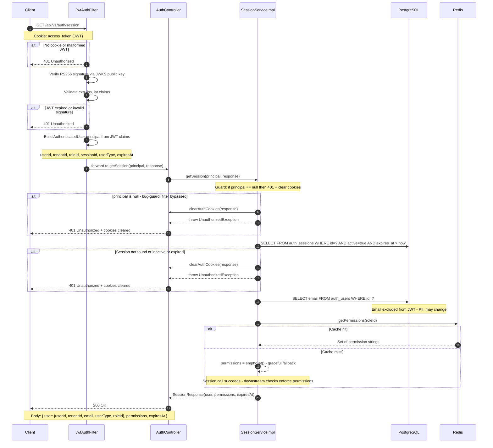

# GET `/api/v1/auth/session`

**File:** `api/controller/AuthController.java` → `application/impl/SessionServiceImpl.java`

Returns the current user's profile and permissions for a valid, authenticated request.
This endpoint is protected by the JWT security filter — the JWT in the `access_token`
cookie is verified before `getSession()` is even called. If the JWT is invalid or absent,
the filter rejects the request with 401 before reaching the controller.

---

## Sequence diagram



---

## Step-by-step breakdown

### Step 0 — JWT filter (before the controller)
**Where:** `JwtAuthFilter` (Spring Security filter chain)

```
Authorization flow:
  1. Extract JWT from access_token cookie
  2. Fetch public key from JWKS endpoint (cached locally)
  3. Verify RS256 signature
  4. Validate exp, iss, iat
  5. Extract claims → build AuthenticatedUser (Spring Security principal)
  6. Store in SecurityContextHolder → forward to controller
```

**Why validate JWT claims in the filter and not in the service?**
Spring Security filters run before Spring MVC dispatches to controllers. Centralising JWT
validation in the filter means every protected endpoint is secured without needing
per-controller boilerplate. The filter rejects invalid JWTs before any service code runs.

**Why RS256?**
The private key is held only by auth-svc. Any downstream service that has the public key
(from `/.well-known/jwks.json`) can independently verify tokens without calling auth-svc.
This makes token validation stateless and horizontally scalable.

---

### Step 1 — Null-principal guard
**Where:** `SessionServiceImpl.getSession()` — first line

```java
@Override
public SessionResponse getSession(AuthenticatedUser principal, HttpServletResponse response) {
    if (principal == null) {
        log.warn("session.unauthenticated");
        clearAuthCookies(response);
        throw new UnauthorizedException();
    }
    UUID sessionId = UUID.fromString(principal.getSessionId());  // safe after guard
    ...
}
```

**Why is this guard needed if the JWT filter already rejects unauthenticated requests?**
In theory, the filter prevents `principal == null` from reaching this method. In practice:
- Tests can call the method directly without a filter
- Misconfigured security rules could inadvertently unprotect the endpoint
- Spring security context can be cleared between the filter and the controller in edge cases

Without the guard, `principal.getSessionId()` would throw a `NullPointerException`, returning
an opaque `500 Internal Server Error`. With the guard, the response is a correct, meaningful
`401 Unauthorized` with cookies cleared (preventing a stale cookie from persisting).

**This guard was a real bug fix.** After logout, cookies are cleared. If the browser sent
a request to `/session` before the cookie deletion propagated, the filter would pass with a
null principal (expired token → no security context populated), and the old code would NPE.

---

### Step 2 — DB session validation
**Where:** `AuthSessionJpaRepository.findByIdAndActiveTrue(sessionId)`

```java
var session = sessionRepo.findByIdAndActiveTrue(sessionId)
        .filter(s -> s.getExpiresAt() == null || s.getExpiresAt().isAfter(now))
        .orElseGet(() -> {
            log.warn("session.invalid sessionId={} userId={}", sessionId, principal.getUserId());
            clearAuthCookies(response);
            throw new UnauthorizedException();
        });
```

**Why check the DB session if the JWT was already validated?**
The JWT is a stateless bearer token — once issued, its signature cannot be revoked.
An administrator revoking a session (`active=false` in Postgres) cannot invalidate a
currently-live JWT. The DB check bridges this gap: it is the canonical revocation signal.

This means:
- A logout that clears Redis and deactivates the session in Postgres is effective immediately
  for new refresh requests **and** for `/session` calls
- The JWT's remaining ~15 minutes of validity is of no consequence for `/session` responses

**Why clear cookies on invalid session?**
The client has valid JWT cookies but an invalid server-side session. Without clearing
cookies, the client would continue to send the cookies on every request, receiving 401 each
time, with no way to recover short of manual cookie deletion. Clearing them triggers the
client to redirect to login.

---

### Step 3 — Email resolution
**Where:** `AuthUserJpaRepository.findById(session.getUserId())`

```java
String email = userRepo.findById(session.getUserId())
        .map(u -> u.getEmail())
        .orElse(null);
```

**Why is email not in the JWT claims?**
Email is PII (Personally Identifiable Information) and can change (user updates their
email). Embedding it in the JWT would mean:
1. Every token reissue is needed to reflect an email change
2. The JWT payload is readable by the client (base64, not encrypted), which is a potential
   PII exposure in logs or network captures

Email is fetched fresh from the DB on each `/session` call. The 15-minute JWT lifetime
means this call is infrequent enough that the extra DB read is acceptable.

---

### Step 4 — Permission resolution
**Where:** `PermissionCacheStore.getPermissions(roleId)`

```java
Set<String> permissions = permissionCache
        .getPermissions(principal.getRoleId())
        .orElse(Collections.emptySet());
```

**Why from a cache and not from the JWT?**
Permissions are role-based and can change (role re-configuration, permission grants).
If embedded in the JWT, a permissions change would not take effect until the user's
token expires and is reissued. The Redis permission cache can be invalidated immediately
when a role changes, so the next `/session` call returns the current permissions.

**Why return empty set on cache miss rather than failing?**
A cache miss (Redis unavailable, key evicted) should not prevent the user from seeing their
session. The response still returns the correct user data; the permissions set will be empty
until the cache is repopulated. Downstream permission checks will naturally deny access
where needed — the session call itself is not a permissions enforcement point.

---

### Step 5 — Response assembly
**Where:** `SessionServiceImpl.getSession()` → `SessionResponse`

```java
SessionUserResponse user = new SessionUserResponse(
        principal.getUserId(),    // from JWT
        principal.getTenantId(),  // from JWT
        email,                    // from DB
        principal.getUserType(),  // from JWT
        principal.getRoleId()     // from JWT
);

return new SessionResponse(user, permissions, principal.getExpiresAt());
```

**Response shape:**
```json
{
  "user": {
    "userId":    "uuid",
    "tenantId":  "uuid",
    "email":     "user@example.com",
    "userType":  "STAFF",
    "roleId":    "uuid"
  },
  "permissions": ["tickets:read", "tickets:write", "..."],
  "expiresAt":   "2024-01-15T10:30:00Z"
}
```

`expiresAt` is the JWT's `exp` claim — the time at which the **access token** expires.
The client can use this to proactively call `/refresh` before expiry rather than waiting
for a 401 response.

---

## Error paths

| Condition | HTTP | Side-effect |
|---|---|---|
| No `access_token` cookie | 401 | Spring Security handles before controller |
| JWT expired | 401 | Spring Security handles before controller |
| JWT invalid signature | 401 | Spring Security handles before controller |
| `principal == null` (post-logout edge case) | 401 | Cookies cleared |
| Session not active in DB | 401 | Cookies cleared |
| Session `expiresAt` in the past | 401 | Cookies cleared |
| Permission cache miss | 200 | `permissions: []` in response |

---

## Structured log keys emitted

| Key | Level | When |
|---|---|---|
| `session.unauthenticated` | WARN | Null principal guard triggered |
| `session.validated` | DEBUG | DB session confirmed active |
| `session.invalid` | WARN | Session not found or inactive |
| `cache.hit type=permissions` | DEBUG | Redis permission cache hit |
| `cache.miss type=permissions` | DEBUG | Redis permission cache miss |
