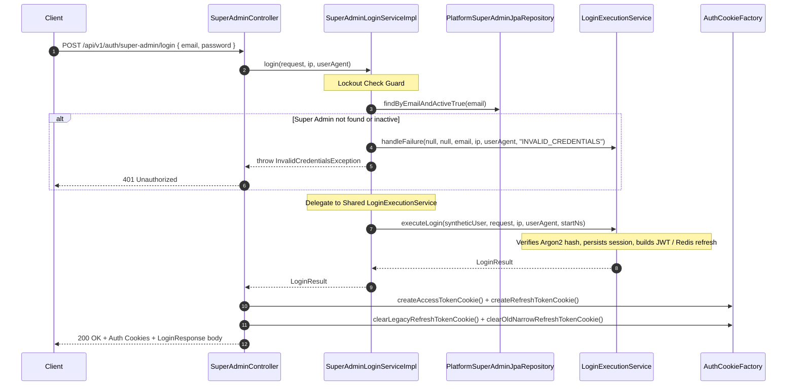
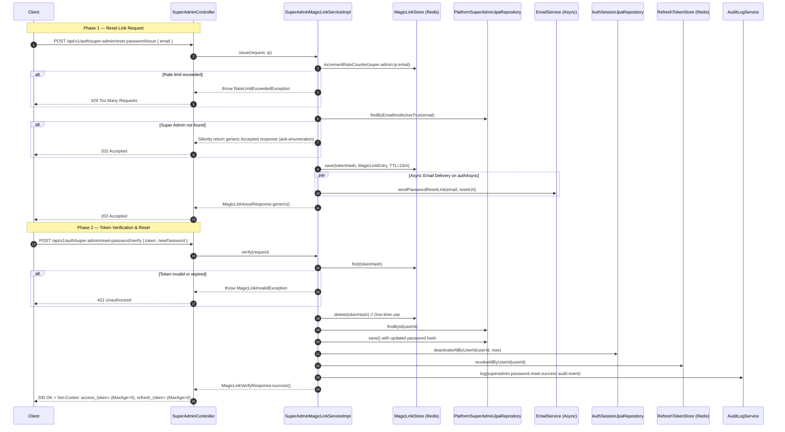

# Super Admin Auth Flow

**File:** `api/controller/SuperAdminController.java` → `application/impl/SuperAdminLoginServiceImpl.java` & `SuperAdminMagicLinkServiceImpl.java`

Handles the authentication and password-reset lifecycle for the platform's root **Super Admin**.

Super Admin credentials are intentionally stored in an isolated table (`platform_super_admin`) to prevent privilege escalation or mixing platform-wide root administration with standard tenant-level user accounts.

---

## Sequence diagram (Login)

---

## Sequence diagram (Magic Link Password Reset)

---

## Key design decisions

### Isolated platform admin storage
Standard tenant users reside in the `auth_users` table. The platform Super Admin is stored exclusively in `platform_super_admin`. This separation of concerns guarantees:
1. **Access Isolation**: Standard SQL queries or accidental joins in tenant management cannot leak or modify Super Admin privileges.
2. **Platform Bootstrapping**: Root platform access can be initialized or recovered even if the tenant databases are completely empty or unconfigured.

### Shared runtime execution
Although the lookup table is isolated, once the Super Admin entity is located, it is mapped to a synthetic `AuthUserEntity` with `UserType.SUPER_ADMIN` and a hardcoded tenant ID of `00000000-0000-0000-0000-000000000000`. This allows the Super Admin login flow to consume the battle-tested, high-performance `LoginExecutionService` path, ensuring identical JWT, Session, Redis, and audit log generation standards.

---

## Idempotent Super Admin Bootstrapping
During application startup, `BootstrapSuperAdminInitializer` performs an idempotent initialisation:
- If no active Super Admin exists, it generates a cryptographically secure random temporary password.
- It inserts the Super Admin record into the `platform_super_admin` table.
- It triggers `EmailService` asynchronously to deliver the temporary bootstrap credentials to the designated platform administrator email.
- The administrator is forced to change their password upon their initial login.

---

## Error paths

| Condition | Exception | HTTP Status |
|---|---|---|
| Invalid email or password | `InvalidCredentialsException` | 401 Unauthorized |
| Super Admin account inactive | `InvalidCredentialsException` | 401 Unauthorized |
| Magic reset token expired or unknown | `MagicLinkInvalidException` | 401 Unauthorized |
| Rate limit hit on password resets | `RateLimitExceededException` | 429 Too Many Requests |
| Confirm password mismatch | Bean Validation (`@PasswordsMatch`) | 400 Bad Request |

---

## Structured log keys emitted

| Key | Level | When |
|---|---|---|
| `superadmin.login.request` | DEBUG | Entry |
| `superadmin.login.started` | INFO | Lookup started |
| `perf.superadmin.login.user_lookup.ms` | INFO | Lookup duration |
| `superadmin.login.user_not_found` | WARN | User missing or inactive |
| `superadmin.login.response` | INFO | Complete with latency |
| `superadmin.magic_link.issue.request` | DEBUG | Reset request entry |
| `superadmin.magic_link.rate_limited` | WARN | Reset rate limited |
| `superadmin.magic_link.issued` | INFO | Reset token mapped in Redis |
| `superadmin.magic_link.invalid` | INFO | Unknown reset token |
| `superadmin.magic_link.expired` | INFO | Token TTL elapsed |
| `superadmin.password.reset.success` | INFO | Password changed via magic link |
| `superadmin.bootstrap.email.sent` | INFO | Bootstrap credentials dispatched |
