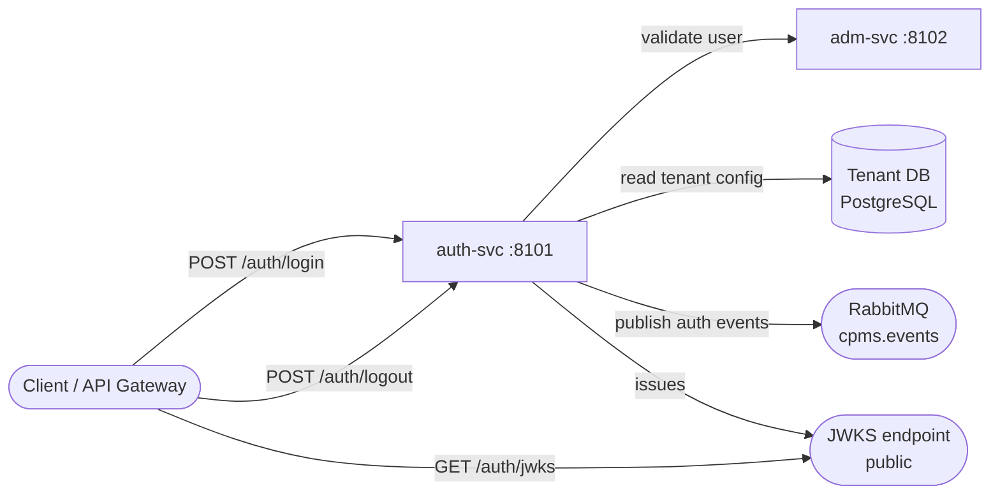

# Auth Service

> JWT authentication service — issues, validates, and revokes tokens for all CPMS tenants.

## Overview

auth-svc is the identity gateway for the platform. Every inbound request from a browser or API client passes through auth-svc to obtain a signed JWT. Downstream services validate that JWT locally using JWKS, so auth-svc is not on the hot path for every request — only for login, logout, and token refresh.

## Architecture

## Key Domains

- **Authentication**: username/password login, token issuance, logout/invalidation
- **Token lifecycle**: JWT generation (RS256), refresh token rotation, revocation list
- **JWKS**: public key endpoint consumed by all downstream services for local validation
- **Tenant resolution**: looks up tenant DB config per request to scope issued tokens

## Technology Stack

| Component | Technology |
|-----------|-----------|
| Runtime | Java 21 |
| Framework | Spring Boot |
| Database | PostgreSQL (Spring Data JPA) |
| Messaging | RabbitMQ |
| Token format | JWT RS256 |

## Message Topology

**Publishes:**
- `auth.login.success` on `cpms.events`
- `auth.logout` on `cpms.events`

**Consumes:**
- None (push-only service)
