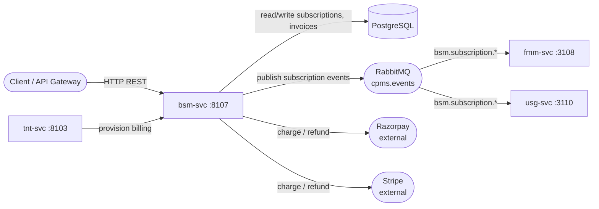

# Billing & Subscription Management Service

> Billing, subscription, and payment service — manages plans, invoices, and payment processing via Razorpay/Stripe.

## Overview

bsm-svc owns the commercial layer of the platform. It tracks subscription plans, tenant subscriptions, invoice generation, and payment collection. Payment processing is delegated to Razorpay (primary) and Stripe (secondary). bsm-svc is called by tnt-svc during tenant provisioning to set up a billing account, and it notifies the rest of the platform when a subscription activates or lapses.

## Architecture

## Key Domains

- **Plans**: plan definitions, feature modules, pricing tiers
- **Subscriptions**: tenant subscription lifecycle (trial, active, past-due, cancelled)
- **Invoices**: invoice generation, line items, PDF rendering
- **Payments**: payment collection, webhook handling from Razorpay/Stripe
- **Refunds**: refund processing and credit note issuance

## Technology Stack

| Component | Technology |
|-----------|-----------|
| Runtime | Java 21 |
| Framework | Spring Boot |
| Database | PostgreSQL (Spring Data JPA) |
| Payment gateways | Razorpay, Stripe |
| Messaging | RabbitMQ |

## Message Topology

**Publishes:**
- `bsm.subscription.activated` on `cpms.events`
- `bsm.subscription.cancelled` on `cpms.events`
- `bsm.invoice.issued` on `cpms.events`
- `bsm.invoice.paid` on `cpms.events`

**Consumes:**
- `tenant.provisioning.completed` — to initialise billing record for new tenant
