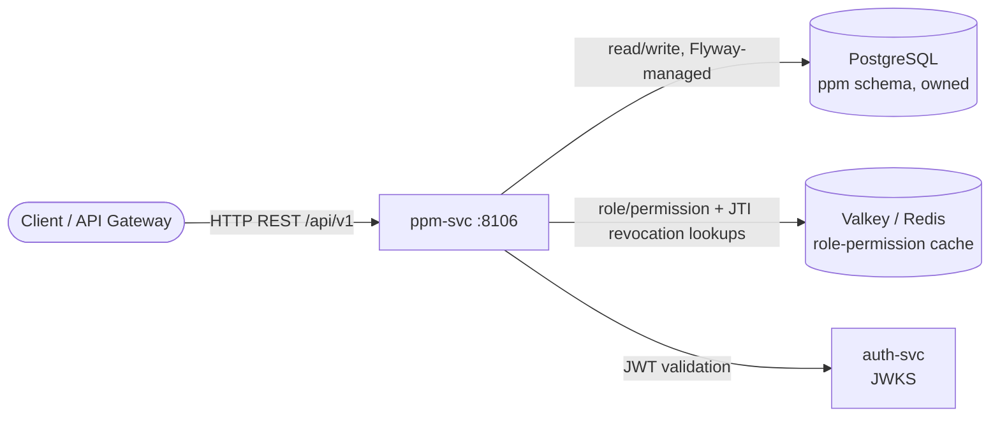

# ppm-svc — Plan & Pricing Management Service

> Owns the subscription plan catalog: plans, versions, modules, entitlements, add-ons, pricing, and promo codes. Consumed by reg-svc (plan resolution at signup) and usg-svc (limit enforcement).

## Overview

ppm-svc is a catalog service — it owns and writes its own domain data (no aggregation from other services). It exposes CRUD and resolution APIs over the plan catalog: plan definitions and versions, module/entitlement/add-on assignments, price resolution by region/currency/cycle, and promo code validation. There is no `tenantId` concept — this is a catalog service, not a per-tenant resource.

## Architecture

Hexagonal-leaning layering: `domain` (framework-free models/ports/enums/exceptions) ← `infrastructure.persistence.adapter` (JPA adapters implementing the ports); `application` (use-case services, currently coupled to `api.dto`/`api.mapper` — see ADR follow-up); `api` (REST controllers, DTOs, mappers).

## Key Domains

- **Plan catalog**: `Plan`, `PlanVersion` — code/slug immutable after creation, soft-delete, versioned limits (`maxInternalUsers`, `maxClientUsers`, `storageQuotaBytes`, feature flags)
- **Modules & entitlements**: `Module`, `Entitlement`, and join aggregates `PlanModule`, `PlanEntitlement` — UUID foreign keys only, no JPA relationship mapping (see ADR-001)
- **Add-ons & pricing**: `AddOn`, `AddOnPrice`, `PlanAddOn` — price resolution by region/currency/billing-cycle/effective-date (`PricingResolverImpl`)
- **Promo codes**: `PromoCode`, `PromoCodePlan` — validation rules (active window, usage cap, plan restriction, first-time-only)

## Technology Stack

| Component | Technology |
|-----------|-----------|
| Runtime | Java 21 |
| Framework | Spring Boot 4 |
| Database | PostgreSQL (Spring Data JPA + Flyway, service-owned schema) |
| Cache | Valkey / Redis (role-permission + JWT revocation lookups only — no domain caching) |
| Security | Spring Security, OAuth2 resource server (JWT via auth-svc JWKS) |
| Messaging | RabbitMQ configured (`cpms.events` exchange, connection + template) — no publishers implemented yet |
| Observability | OpenTelemetry (OTLP), Micrometer/Prometheus |
| API Docs | Springdoc OpenAPI 3 (`/v1/docs`) |

## Message Topology

**Publishes:** None implemented yet. `RabbitConfig` wires the `cpms.events` exchange and a `RabbitTemplate`, following the same platform convention used by adm-svc/bsm-svc/pmt-svc/tnt-svc, but no `rabbitTemplate.convertAndSend` call exists in the codebase. Plan-change event publishing is reserved future work, not a bug.

**Consumes:** None.

## Controllers (REST surface, `/api/v1`)

`PlanController`, `PlanVersionController`, `ModuleController`, `PlanModuleController`, `EntitlementController`, `PlanEntitlementController`, `AddOnController`, `PlanAddOnController`, `PlanPriceController`, `PricingResolverController`, `PromoCodeController`, `PromoCodePlanController`, `PromoValidationController`.
